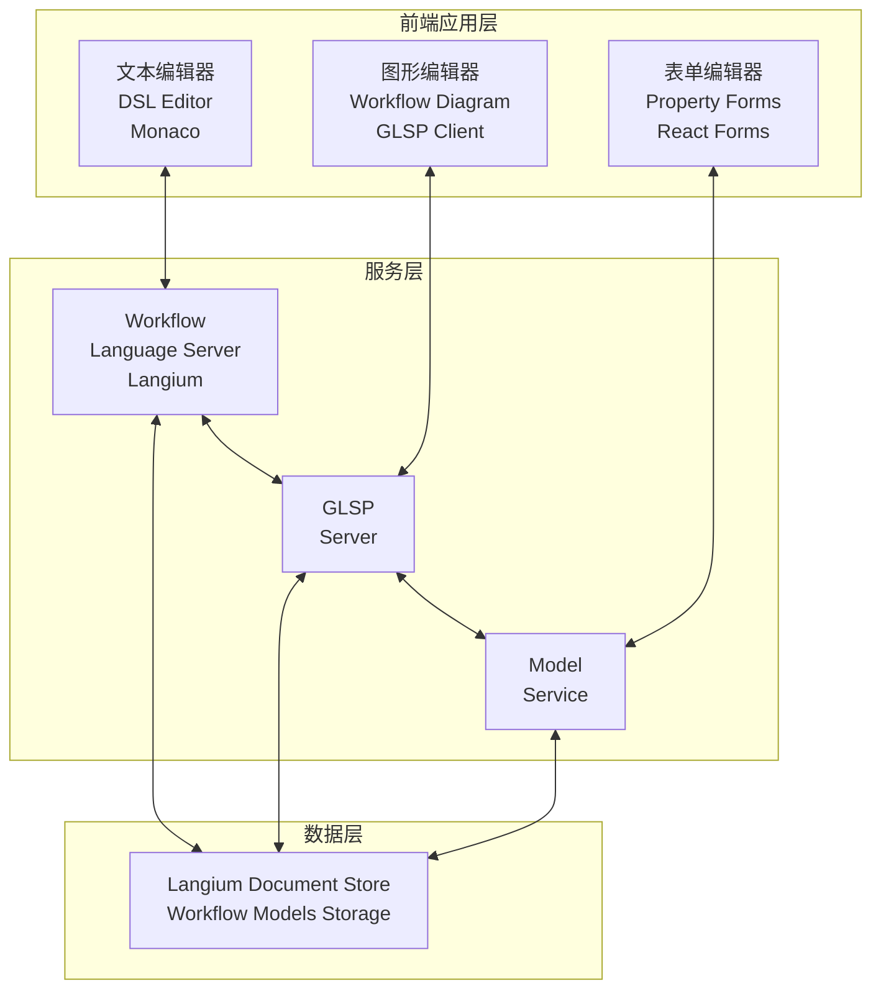
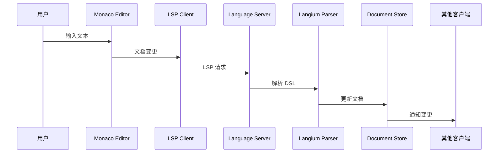
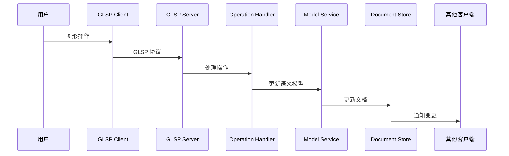
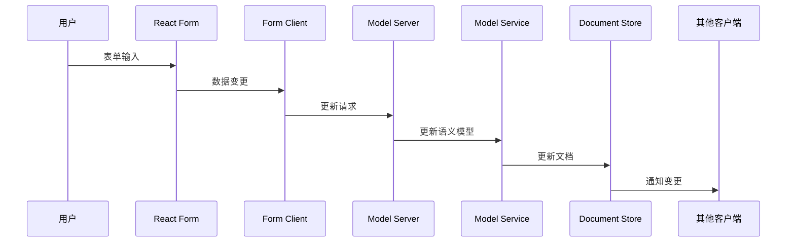

# 架构设计和扩展指南

本文档详细介绍了业务流程建模系统的架构设计，以及如何扩展系统功能。

## 目录

- [系统架构概述](#系统架构概述)
- [核心组件](#核心组件)
- [数据流](#数据流)
- [扩展机制](#扩展机制)
- [开发指南](#开发指南)

## 系统架构概述

业务流程建模系统基于 CrossModel 架构构建，采用 Langium + GLSP + Theia 技术栈，支持三种建模方式：文本、图形和表单。

### 整体架构图

**系统架构可视化：**



**传统架构图：**

```
┌─────────────────────────────────────────────────────────────┐
│                    前端应用层                                 │
│  ┌─────────────────┬─────────────────┬─────────────────────┐ │
│  │   文本编辑器     │   图形编辑器     │    表单编辑器        │ │
│  │  (DSL Editor)   │ (Workflow Diagram)│  (Property Forms)  │ │
│  │   Monaco        │     GLSP Client  │    React Forms     │ │
│  └─────────────────┴─────────────────┴─────────────────────┘ │
├─────────────────────────────────────────────────────────────┤
│                    服务层                                    │
│  ┌─────────────────┬─────────────────┬─────────────────────┐ │
│  │ Workflow        │ GLSP            │ Model               │ │
│  │ Language Server │ Server          │ Service             │ │
│  │   (Langium)     │                 │                     │ │
│  └─────────────────┴─────────────────┴─────────────────────┘ │
├─────────────────────────────────────────────────────────────┤
│                    数据层                                    │
│              Langium Document Store                         │
│            (Workflow Models Storage)                        │
└─────────────────────────────────────────────────────────────┘
```

### 技术栈

| 层级     | 技术                | 用途           |
| -------- | ------------------- | -------------- |
| 前端框架 | Theia               | IDE 框架       |
| 文本编辑 | Monaco Editor       | DSL 文本编辑   |
| 图形编辑 | GLSP                | 图形化流程编辑 |
| 表单编辑 | React + PrimeReact  | 属性表单编辑   |
| 语言服务 | Langium             | DSL 解析和验证 |
| 通信协议 | LSP / GLSP Protocol | 前后端通信     |

## 核心组件

### 1. 工作流程语言服务器 (Workflow Language Server)

位置：`packages/server/src/language-server/`

负责 DSL 的解析、验证和语言服务功能。

#### 主要文件

```
language-server/
├── workflow-grammar.langium      # DSL 语法定义
├── workflow-validator.ts         # 语义验证器
├── workflow-scope-provider.ts    # 作用域提供器
├── workflow-completion-provider.ts # 自动完成
├── workflow-hover-provider.ts    # 悬停提示
└── workflow-formatter.ts         # 代码格式化
```

#### 语法定义示例

```langium
grammar WorkflowDSL

entry WorkflowModel:
    'workflow' ':' INDENT
        'id' ':' id=ID NEWLINE
        'name' ':' name=STRING NEWLINE
        ('metadata' ':' metadata=Metadata)?
        'nodes' ':' INDENT (nodes+=Node)+ DEDENT
        'edges' ':' INDENT (edges+=Edge)+ DEDENT
        ('swimlanes' ':' INDENT (swimlanes+=Swimlane)+ DEDENT)?
    DEDENT;

Node:
    BeginNode | EndNode | ProcessNode | DecisionNode |
    DecisionTableNode | ConcurrentNode | SubprocessNode |
    AutoNode | ApiNode | ExceptionNode;

BeginNode:
    '-' 'begin' ':' INDENT
        'id' ':' id=ID NEWLINE
        'name' ':' name=STRING NEWLINE
        ('description' ':' description=STRING NEWLINE)?
        ('position' ':' position=Position)?
    DEDENT;

// ... 其他节点定义
```

#### 验证器实现

```typescript
// workflow-validator.ts
import { ValidationAcceptor, ValidationChecks } from 'langium';
import { WorkflowDSLAstType, WorkflowModel, DecisionNode } from './generated/ast';

export function registerValidationChecks(services: WorkflowDSLServices): void {
   const registry = services.validation.ValidationRegistry;
   const validator = services.validation.WorkflowValidator;

   const checks: ValidationChecks<WorkflowDSLAstType> = {
      WorkflowModel: validator.checkWorkflowModel,
      DecisionNode: validator.checkDecisionNode,
      DecisionTableNode: validator.checkDecisionTable,
      ConcurrentNode: validator.checkConcurrentNode
   };

   registry.register(checks, validator);
}

export class WorkflowValidator {
   checkWorkflowModel(model: WorkflowModel, accept: ValidationAcceptor): void {
      // 检查是否有且只有一个开始节点
      const beginNodes = model.nodes.filter(n => n.$type === 'BeginNode');
      if (beginNodes.length === 0) {
         accept('error', '工作流程必须有一个开始节点', { node: model });
      } else if (beginNodes.length > 1) {
         accept('error', '工作流程只能有一个开始节点', { node: model });
      }

      // 检查是否至少有一个结束节点
      const endNodes = model.nodes.filter(n => n.$type === 'EndNode' || n.$type === 'ExceptionNode');
      if (endNodes.length === 0) {
         accept('error', '工作流程必须至少有一个结束节点', { node: model });
      }
   }

   checkDecisionNode(node: DecisionNode, accept: ValidationAcceptor): void {
      // 检查分支值唯一性
      const values = node.branches.map(b => b.value);
      const uniqueValues = new Set(values);
      if (values.length !== uniqueValues.size) {
         accept('error', '分支节点的输出边值必须唯一', { node: node });
      }
   }
}
```

### 2. GLSP 工作流程服务器 (GLSP Workflow Server)

位置：`packages/server/src/glsp-server/`

负责图形编辑器的后端逻辑。

#### 主要文件

```
glsp-server/
├── workflow-diagram-module.ts    # 依赖注入模块
├── workflow-model-factory.ts     # 模型工厂
├── workflow-gmodel-factory.ts    # GModel 工厂
├── workflow-diagram-configuration.ts # 图形配置
└── operations/
    ├── create-node-handler.ts    # 创建节点处理器
    ├── create-edge-handler.ts    # 创建边处理器
    ├── delete-handler.ts         # 删除处理器
    └── move-handler.ts           # 移动处理器
```

#### 模型工厂示例

```typescript
// workflow-gmodel-factory.ts
import { GModelFactory, GNode, GEdge, GLabel } from '@eclipse-glsp/server';
import { WorkflowModel, WorkflowNode } from '../language-server/generated/ast';

export class WorkflowGModelFactory implements GModelFactory {
   create(model: WorkflowModel): GModelRoot {
      const root = GModelRoot.builder().id(model.id).build();

      // 转换节点
      for (const node of model.nodes) {
         root.children.push(this.createGNode(node));
      }

      // 转换边
      for (const edge of model.edges) {
         root.children.push(this.createGEdge(edge));
      }

      return root;
   }

   private createGNode(node: WorkflowNode): GNode {
      const nodeType = this.getNodeType(node);
      return GNode.builder()
         .id(node.id)
         .type(nodeType)
         .position({ x: node.position?.x ?? 0, y: node.position?.y ?? 0 })
         .addCssClass(this.getNodeCssClass(node))
         .add(GLabel.builder().text(node.name).build())
         .build();
   }

   private getNodeType(node: WorkflowNode): string {
      switch (node.$type) {
         case 'BeginNode':
            return 'node:begin';
         case 'EndNode':
            return 'node:end';
         case 'ProcessNode':
            return 'node:process';
         case 'DecisionNode':
            return 'node:decision';
         case 'DecisionTableNode':
            return 'node:decision-table';
         case 'ConcurrentNode':
            return 'node:concurrent';
         default:
            return 'node:default';
      }
   }
}
```

### 3. 模型服务 (Model Service)

位置：`packages/server/src/model-server/`

提供统一的模型访问接口。

#### 主要文件

```
model-server/
├── workflow-model-service.ts     # 模型服务
├── workflow-serializer.ts        # 序列化器
└── workflow-model-state.ts       # 模型状态管理
```

#### 模型服务接口

```typescript
// workflow-model-service.ts
export interface WorkflowModelService {
   // 文档生命周期
   open(uri: string): Promise<WorkflowModel>;
   save(uri: string): Promise<void>;
   close(uri: string): Promise<void>;

   // 节点操作
   createNode(uri: string, type: NodeType, properties: NodeProperties): Promise<WorkflowNode>;
   updateNode(uri: string, nodeId: string, properties: Partial<NodeProperties>): Promise<void>;
   deleteNode(uri: string, nodeId: string): Promise<void>;

   // 边操作
   createEdge(uri: string, sourceId: string, targetId: string, properties?: EdgeProperties): Promise<WorkflowEdge>;
   updateEdge(uri: string, edgeId: string, properties: Partial<EdgeProperties>): Promise<void>;
   deleteEdge(uri: string, edgeId: string): Promise<void>;

   // 决策表操作
   updateDecisionTable(uri: string, nodeId: string, tableData: DecisionTableData): Promise<void>;
   validateDecisionTable(tableData: DecisionTableData): ValidationResult;

   // 泳道操作
   createSwimlane(uri: string, properties: SwimlaneProperties): Promise<Swimlane>;
   addNodeToSwimlane(uri: string, nodeId: string, swimlaneId: string): Promise<void>;

   // 引用节点操作
   createReference(uri: string, sourceNodeId: string): Promise<ReferenceNode>;
   batchCreateReferences(uri: string, nodeIds: string[]): Promise<ReferenceNode[]>;
}
```

### 4. 前端组件

#### 图形客户端 (GLSP Client)

位置：`packages/glsp-client/src/`

```
glsp-client/src/
├── workflow-diagram/
│   ├── workflow-diagram-widget.ts    # 图形编辑器组件
│   ├── workflow-palette.ts           # 工具面板
│   ├── workflow-context-menu.ts      # 上下文菜单
│   └── workflow-tool-manager.ts      # 工具管理器
├── workflow-views/
│   ├── begin-node-view.tsx           # 开始节点视图
│   ├── end-node-view.tsx             # 结束节点视图
│   ├── process-node-view.tsx         # 过程节点视图
│   ├── decision-node-view.tsx        # 分支节点视图
│   ├── decision-table-view.tsx       # 决策表节点视图
│   └── swimlane-view.tsx             # 泳道视图
└── di.config.ts                      # 依赖注入配置
```

#### 表单客户端 (Form Client)

位置：`packages/form-client/src/`

```
form-client/src/
├── workflow-forms/
│   ├── node-properties-form.tsx      # 节点属性表单
│   ├── decision-table-editor.tsx     # 决策表编辑器
│   ├── test-data-form.tsx            # 测试数据表单
│   └── automation-action-form.tsx    # 自动化动作表单
├── workflow-property-view/
│   └── workflow-property-widget.ts   # 属性视图组件
└── index.ts
```

## 数据流

### 1. 文本编辑数据流

**数据流可视化：**



**传统流程图：**

```
用户输入 → Monaco Editor → LSP Client → Language Server
                                              ↓
                                    Langium Parser
                                              ↓
                                    Document Store (更新)
                                              ↓
                              通知其他客户端 (GLSP, Form)
```

### 2. 图形编辑数据流

**数据流可视化：**



**传统流程图：**

```
用户操作 → GLSP Client → GLSP Protocol → GLSP Server
                                              ↓
                                    Operation Handler
                                              ↓
                                    Model Service (更新语义模型)
                                              ↓
                                    Document Store (更新)
                                              ↓
                              通知其他客户端 (Monaco, Form)
```

### 3. 表单编辑数据流

**数据流可视化：**



**传统流程图：**

```
用户输入 → React Form → Form Client → Model Server
                                           ↓
                                    Model Service (更新语义模型)
                                           ↓
                                    Document Store (更新)
                                           ↓
                              通知其他客户端 (Monaco, GLSP)
```

### 4. 同步机制

```typescript
// 同步监听器示例
class WorkflowSyncListener implements DocumentChangeListener {
   onDocumentChanged(uri: string, model: WorkflowModel, source: string): void {
      // 通知所有客户端（除了触发更新的客户端）
      this.notifyClients(uri, model, source);
   }

   private notifyClients(uri: string, model: WorkflowModel, excludeSource: string): void {
      if (excludeSource !== 'monaco') {
         this.monacoClient.updateDocument(uri, this.serializer.serialize(model));
      }
      if (excludeSource !== 'glsp') {
         this.glspClient.updateModel(uri, model);
      }
      if (excludeSource !== 'form') {
         this.formClient.updateModel(uri, model);
      }
   }
}
```

## 扩展机制

### 1. 添加新节点类型

#### 步骤 1: 更新语法定义

```langium
// workflow-grammar.langium
Node:
    BeginNode | EndNode | ProcessNode | DecisionNode |
    DecisionTableNode | ConcurrentNode | SubprocessNode |
    AutoNode | ApiNode | ExceptionNode |
    CustomNode;  // 添加新节点类型

CustomNode:
    '-' 'custom' ':' INDENT
        'id' ':' id=ID NEWLINE
        'name' ':' name=STRING NEWLINE
        ('description' ':' description=STRING NEWLINE)?
        ('customProperty' ':' customProperty=STRING NEWLINE)?
        ('position' ':' position=Position)?
    DEDENT;
```

#### 步骤 2: 添加验证规则

```typescript
// workflow-validator.ts
checkCustomNode(node: CustomNode, accept: ValidationAcceptor): void {
    if (!node.customProperty) {
        accept('warning', '建议设置 customProperty', { node: node });
    }
}
```

#### 步骤 3: 创建图形视图

```typescript
// custom-node-view.tsx
import { RectangularNodeView, RenderingContext, svg } from '@eclipse-glsp/client';

export class CustomNodeView extends RectangularNodeView {
   render(node: GNode, context: RenderingContext): VNode {
      return svg('g', [
         svg('rect', {
            class: 'custom-node',
            width: node.size.width,
            height: node.size.height,
            rx: 5,
            ry: 5
         }),
         svg(
            'text',
            {
               x: node.size.width / 2,
               y: node.size.height / 2,
               'text-anchor': 'middle'
            },
            node.children.find(c => c.type === 'label')?.text ?? ''
         )
      ]);
   }
}
```

#### 步骤 4: 注册节点类型

```typescript
// di.config.ts
bind(TYPES.IView).to(CustomNodeView).whenTargetNamed('node:custom');
```

### 2. 添加新操作

```typescript
// custom-operation-handler.ts
import { OperationHandler, CreateNodeOperation } from '@eclipse-glsp/server';

@injectable()
export class CustomOperationHandler implements OperationHandler {
   readonly operationType = 'customOperation';

   execute(operation: CustomOperation): void {
      const model = this.modelState.getModel();
      // 执行自定义操作
      this.modelService.performCustomOperation(model, operation.params);
   }
}
```

### 3. 添加新验证规则

```typescript
// custom-validation.ts
export class CustomValidationRule implements ValidationRule {
   validate(model: WorkflowModel): ValidationResult[] {
      const results: ValidationResult[] = [];

      // 自定义验证逻辑
      for (const node of model.nodes) {
         if (this.isInvalid(node)) {
            results.push({
               severity: 'error',
               message: '自定义验证错误',
               node: node
            });
         }
      }

      return results;
   }
}
```

### 4. 添加新表单组件

```typescript
// custom-form.tsx
import React from 'react';
import { InputText } from 'primereact/inputtext';

interface CustomFormProps {
    node: CustomNode;
    onChange: (node: CustomNode) => void;
}

export const CustomForm: React.FC<CustomFormProps> = ({ node, onChange }) => {
    return (
        <div className="custom-form">
            <label>自定义属性</label>
            <InputText
                value={node.customProperty ?? ''}
                onChange={(e) => onChange({
                    ...node,
                    customProperty: e.target.value
                })}
            />
        </div>
    );
};
```

## 开发指南

### 环境设置

1. 安装依赖：

```bash
yarn install
```

2. 生成语言服务器代码：

```bash
yarn langium:generate
```

3. 构建项目：

```bash
yarn build
```

4. 启动开发服务器：

```bash
yarn watch:browser
# 或
yarn watch:electron
```

### 调试

#### 调试语言服务器

1. 在 VS Code 中打开项目
2. 选择 "Debug Language Server" 配置
3. 设置断点
4. 按 F5 启动调试

#### 调试 GLSP 服务器

1. 在 VS Code 中打开项目
2. 选择 "Debug GLSP Server" 配置
3. 设置断点
4. 按 F5 启动调试

### 测试

```bash
# 运行所有测试
yarn test

# 运行特定包的测试
yarn workspace @crossmodel/server test

# 运行端到端测试
yarn ui-test
```

### 代码规范

- 使用 ESLint 进行代码检查
- 使用 Prettier 进行代码格式化
- 遵循 Conventional Commits 规范

```bash
# 检查代码
yarn lint

# 格式化代码
yarn format
```

## 相关文档

- [DSL 语法参考](./DSL-Reference.md)
- [API 参考文档](./API-Reference.md)
- [贡献指南](../../CONTRIBUTING.md)
