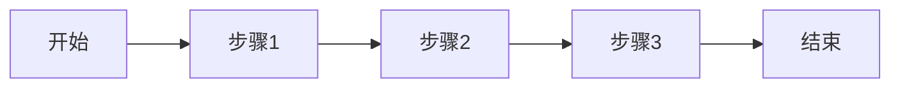
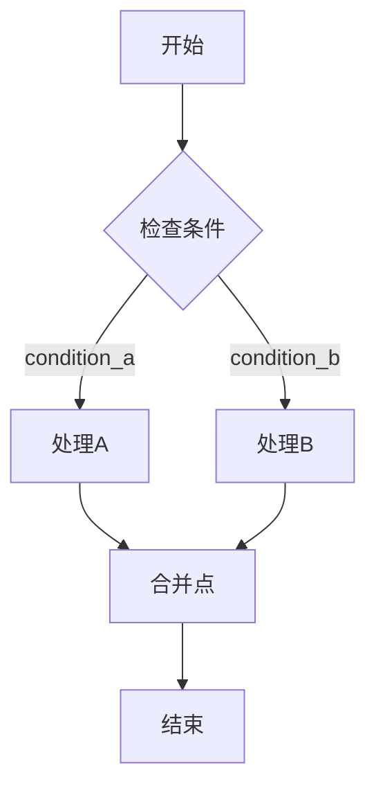
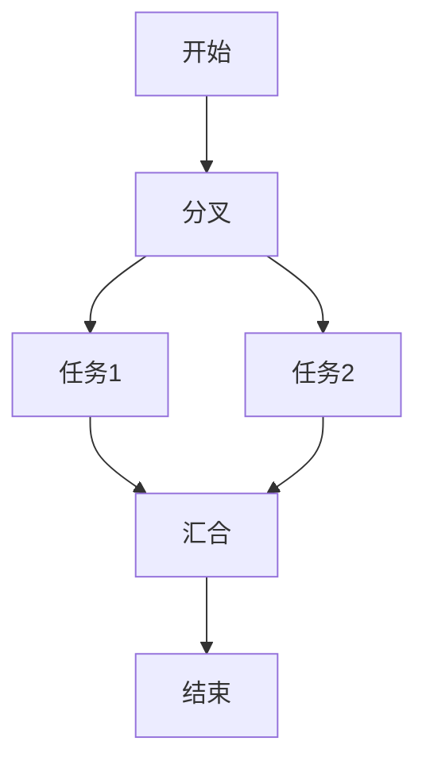
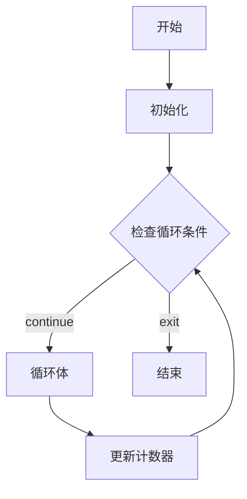
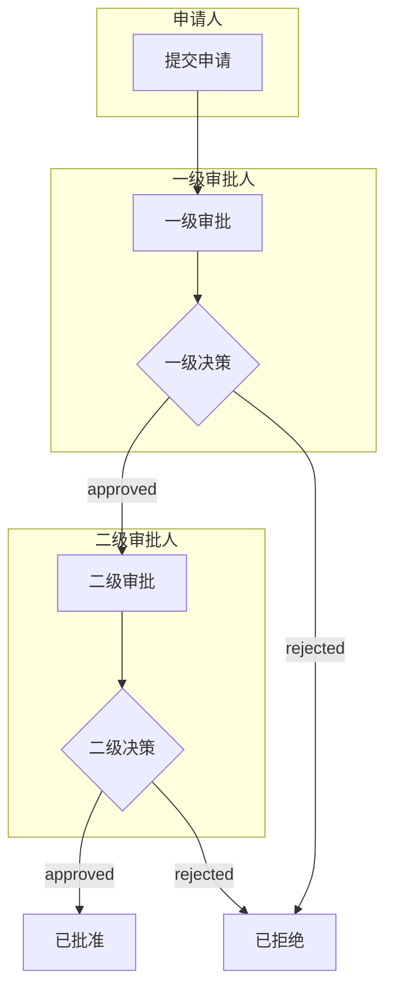

# 最佳实践和设计模式

本文档介绍了业务流程建模的最佳实践和常用设计模式，帮助您创建高质量、可维护的工作流程。

## 目录

- [命名规范](#命名规范)
- [流程设计原则](#流程设计原则)
- [常用设计模式](#常用设计模式)
- [性能优化](#性能优化)
- [错误处理](#错误处理)
- [测试策略](#测试策略)
- [版本管理](#版本管理)

## 命名规范

### 工作流程命名

- 使用有意义的名称，清晰描述流程目的
- 使用下划线分隔单词（snake_case）
- 避免使用特殊字符

**推荐：**

```yaml
workflow:
   id: order_processing
   name: '订单处理流程'
```

**不推荐：**

```yaml
workflow:
   id: op1
   name: '流程1'
```

### 节点命名

- 使用动词+名词的形式描述节点功能
- 保持命名简洁但有意义
- 同类型节点使用一致的命名风格

**推荐：**

```yaml
- process:
     id: validate_order
     name: '验证订单'

- process:
     id: process_payment
     name: '处理支付'
```

### ID 命名规范

| 元素类型 | 命名规范                 | 示例                    |
| -------- | ------------------------ | ----------------------- |
| 工作流程 | snake_case               | `order_processing`      |
| 节点     | snake_case               | `validate_order`        |
| 边       | edge\_数字 或 描述性名称 | `edge_1`, `to_approval` |
| 泳道     | lane\_名称               | `lane_manager`          |

## 流程设计原则

### 1. 单一职责原则

每个节点应该只负责一个明确的任务。

**推荐：**

```yaml
nodes:
   - process:
        id: validate_data
        name: '验证数据'
   - process:
        id: save_data
        name: '保存数据'
   - process:
        id: send_notification
        name: '发送通知'
```

**不推荐：**

```yaml
nodes:
   - process:
        id: do_everything
        name: '验证保存并通知'
```

### 2. 清晰的流程路径

- 确保每个节点都有明确的入边和出边
- 避免孤立节点
- 所有路径最终都应该到达结束节点

### 3. 适当的粒度

- 避免过于细粒度的节点划分
- 避免过于粗粒度的节点设计
- 根据业务逻辑的复杂度合理划分

### 4. 可读性优先

- 使用有意义的名称和描述
- 合理安排节点位置
- 使用泳道组织相关节点

## 常用设计模式

### 模式1：顺序流程

最简单的流程模式，节点按顺序执行。

**流程图可视化：**



```yaml
workflow:
   id: sequential_process
   name: '顺序流程'
   nodes:
      - begin:
           id: start
           name: '开始'
      - process:
           id: step_1
           name: '步骤1'
      - process:
           id: step_2
           name: '步骤2'
      - process:
           id: step_3
           name: '步骤3'
      - end:
           id: finish
           name: '结束'
           expectedValue: 'completed'
   edges:
      - edge:
           id: e1
           source: start
           target: step_1
      - edge:
           id: e2
           source: step_1
           target: step_2
      - edge:
           id: e3
           source: step_2
           target: step_3
      - edge:
           id: e4
           source: step_3
           target: finish
```

### 模式2：条件分支

根据条件选择不同的执行路径。

**流程图可视化：**



```yaml
workflow:
   id: conditional_branch
   name: '条件分支'
   nodes:
      - begin:
           id: start
           name: '开始'
      - decision:
           id: check_condition
           name: '检查条件'
           branches:
              - id: path_a
                value: 'condition_a'
              - id: path_b
                value: 'condition_b'
                isDefault: true
      - process:
           id: process_a
           name: '处理A'
      - process:
           id: process_b
           name: '处理B'
      - process:
           id: merge_point
           name: '合并点'
      - end:
           id: finish
           name: '结束'
           expectedValue: 'completed'
   edges:
      - edge:
           id: e1
           source: start
           target: check_condition
      - edge:
           id: e2
           source: check_condition
           target: process_a
           value: 'condition_a'
      - edge:
           id: e3
           source: check_condition
           target: process_b
           value: 'condition_b'
      - edge:
           id: e4
           source: process_a
           target: merge_point
      - edge:
           id: e5
           source: process_b
           target: merge_point
      - edge:
           id: e6
           source: merge_point
           target: finish
```

### 模式3：并行处理

多个任务同时执行，提高效率。

**流程图可视化：**



```yaml
workflow:
   id: parallel_processing
   name: '并行处理'
   nodes:
      - begin:
           id: start
           name: '开始'
      - concurrent:
           id: fork
           name: '分叉'
           parallelBranches:
              - id: branch_1
                name: '分支1'
              - id: branch_2
                name: '分支2'
      - process:
           id: task_1
           name: '任务1'
      - process:
           id: task_2
           name: '任务2'
      - concurrent:
           id: join
           name: '汇合'
      - end:
           id: finish
           name: '结束'
           expectedValue: 'completed'
   edges:
      - edge:
           id: e1
           source: start
           target: fork
      - edge:
           id: e2
           source: fork
           target: task_1
      - edge:
           id: e3
           source: fork
           target: task_2
      - edge:
           id: e4
           source: task_1
           target: join
      - edge:
           id: e5
           source: task_2
           target: join
      - edge:
           id: e6
           source: join
           target: finish
```

### 模式4：循环处理

通过子流程实现循环逻辑。

**流程图可视化：**



```yaml
workflow:
   id: loop_pattern
   name: '循环模式'
   nodes:
      - begin:
           id: start
           name: '开始'
      - process:
           id: initialize
           name: '初始化'
      - decision:
           id: check_loop
           name: '检查循环条件'
           branches:
              - id: continue_loop
                value: 'continue'
              - id: exit_loop
                value: 'exit'
                isDefault: true
      - process:
           id: loop_body
           name: '循环体'
      - process:
           id: update_counter
           name: '更新计数器'
      - end:
           id: finish
           name: '结束'
           expectedValue: 'completed'
   edges:
      - edge:
           id: e1
           source: start
           target: initialize
      - edge:
           id: e2
           source: initialize
           target: check_loop
      - edge:
           id: e3
           source: check_loop
           target: loop_body
           value: 'continue'
      - edge:
           id: e4
           source: loop_body
           target: update_counter
      - edge:
           id: e5
           source: update_counter
           target: check_loop
      - edge:
           id: e6
           source: check_loop
           target: finish
           value: 'exit'
```

### 模式5：多级审批

适用于需要多个审批人的场景。

**流程图可视化：**



```yaml
workflow:
   id: multi_level_approval
   name: '多级审批'
   nodes:
      - begin:
           id: submit
           name: '提交申请'
      - process:
           id: level_1_review
           name: '一级审批'
      - decision:
           id: level_1_decision
           name: '一级决策'
           branches:
              - id: l1_approve
                value: 'approved'
              - id: l1_reject
                value: 'rejected'
                isDefault: true
      - process:
           id: level_2_review
           name: '二级审批'
      - decision:
           id: level_2_decision
           name: '二级决策'
           branches:
              - id: l2_approve
                value: 'approved'
              - id: l2_reject
                value: 'rejected'
                isDefault: true
      - end:
           id: approved
           name: '已批准'
           expectedValue: 'approved'
      - end:
           id: rejected
           name: '已拒绝'
           expectedValue: 'rejected'
   edges:
      - edge:
           id: e1
           source: submit
           target: level_1_review
      - edge:
           id: e2
           source: level_1_review
           target: level_1_decision
      - edge:
           id: e3
           source: level_1_decision
           target: level_2_review
           value: 'approved'
      - edge:
           id: e4
           source: level_1_decision
           target: rejected
           value: 'rejected'
      - edge:
           id: e5
           source: level_2_review
           target: level_2_decision
      - edge:
           id: e6
           source: level_2_decision
           target: approved
           value: 'approved'
      - edge:
           id: e7
           source: level_2_decision
           target: rejected
           value: 'rejected'
   swimlanes:
      - swimlane:
           id: lane_applicant
           name: '申请人'
           containedNodes:
              - ref: submit
      - swimlane:
           id: lane_level_1
           name: '一级审批人'
           containedNodes:
              - ref: level_1_review
              - ref: level_1_decision
      - swimlane:
           id: lane_level_2
           name: '二级审批人'
           containedNodes:
              - ref: level_2_review
              - ref: level_2_decision
```

## 性能优化

### 1. 减少不必要的节点

- 合并可以一起执行的简单操作
- 避免创建只做转发的空节点

### 2. 合理使用并行处理

- 识别可以并行执行的独立任务
- 避免过度并行化导致资源竞争

### 3. 优化决策表

- 将最常匹配的规则放在前面
- 避免过于复杂的条件表达式
- 定期清理不再使用的规则

### 4. 使用子流程

- 将复杂流程拆分为子流程
- 复用通用的流程逻辑
- 减少主流程的复杂度

## 错误处理

### 1. 异常节点使用

为每种可能的异常情况创建专门的异常节点：

```yaml
nodes:
   - exception:
        id: validation_error
        name: '验证失败'
        expectedValue: 'validation_error'
        errorCode: 'ERR_VALIDATION'
   - exception:
        id: timeout_error
        name: '超时错误'
        expectedValue: 'timeout_error'
        errorCode: 'ERR_TIMEOUT'
   - exception:
        id: system_error
        name: '系统错误'
        expectedValue: 'system_error'
        errorCode: 'ERR_SYSTEM'
```

### 2. 错误恢复策略

- 设计重试机制
- 提供手动干预入口
- 记录详细的错误信息

### 3. 补偿事务

对于需要回滚的操作，设计补偿流程：

```yaml
# 主流程中的补偿设计
- process:
     id: reserve_inventory
     name: '预留库存'
     compensationAction: 'release_inventory'

- process:
     id: charge_payment
     name: '扣款'
     compensationAction: 'refund_payment'
```

## 测试策略

### 1. 单元测试

为每个节点配置测试数据：

```yaml
- process:
     id: calculate_discount
     name: '计算折扣'
     testData:
        - id: test_normal
          name: '正常订单'
          inputData:
             orderAmount: 1000
             customerLevel: 'gold'
          expectedOutput:
             discount: 0.15
        - id: test_new_customer
          name: '新客户'
          inputData:
             orderAmount: 500
             customerLevel: 'new'
          expectedOutput:
             discount: 0.05
```

### 2. 路径测试

确保测试覆盖所有可能的执行路径：

- 正常路径
- 异常路径
- 边界条件
- 并行分支

### 3. 集成测试

测试与外部系统的集成：

- API 调用
- 数据库操作
- 消息队列

## 版本管理

### 1. 版本号规范

使用语义化版本号：

```yaml
metadata:
   version: '1.2.3' # 主版本.次版本.修订版本
```

- 主版本：不兼容的变更
- 次版本：向后兼容的功能新增
- 修订版本：向后兼容的问题修复

### 2. 变更记录

在工作流程中记录变更历史：

```yaml
metadata:
   version: '1.1.0'
   changelog:
      - version: '1.1.0'
        date: '2024-01-15'
        changes:
           - '添加二级审批流程'
           - '优化决策表规则'
      - version: '1.0.0'
        date: '2024-01-01'
        changes:
           - '初始版本'
```

### 3. 分支策略

- 使用 Git 分支管理不同版本
- 为重大变更创建独立分支
- 定期合并和清理分支

## 文档规范

### 1. 流程文档

每个工作流程应包含：

- 流程目的和范围
- 输入输出说明
- 前置条件和后置条件
- 异常处理说明

### 2. 节点文档

关键节点应包含：

- 功能描述
- 输入参数
- 输出结果
- 业务规则

### 3. 维护文档

- 常见问题解答
- 故障排除指南
- 联系人信息

## 安全考虑

### 1. 敏感数据处理

- 避免在流程定义中硬编码敏感信息
- 使用变量引用配置中心的值
- 对敏感数据进行脱敏处理

### 2. 权限控制

- 使用泳道区分不同角色的职责
- 在节点级别配置访问权限
- 记录操作审计日志

### 3. 输入验证

- 在流程入口验证输入数据
- 对外部输入进行安全检查
- 防止注入攻击

## 相关文档

- [DSL 语法参考](./DSL-Reference.md)
- [节点类型使用指南](./Node-Types-Guide.md)
- [架构设计文档](../Architecture.md)
- [工作流程图例说明](./Diagram-Legend.md)
