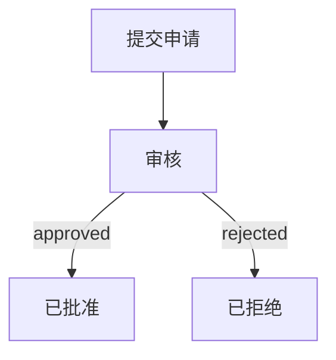
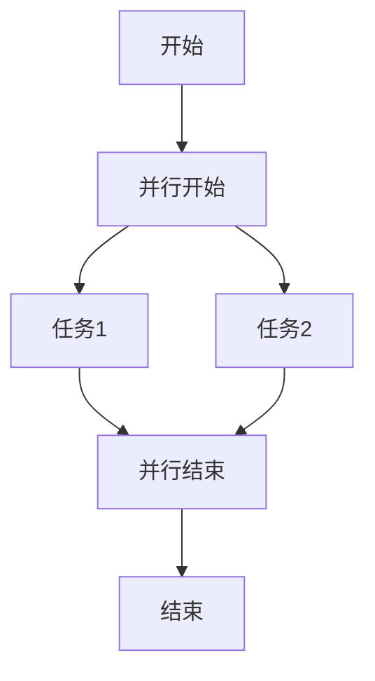

# 工作流程 DSL 语法参考

本文档提供了业务流程建模系统 DSL（领域特定语言）的完整语法参考。

## 目录

- [概述](#概述)
- [基本结构](#基本结构)
- [节点类型](#节点类型)
- [边定义](#边定义)
- [泳道定义](#泳道定义)
- [决策表](#决策表)
- [完整示例](#完整示例)

## 概述

工作流程 DSL 是一种基于 YAML 风格的声明式语言，用于定义业务流程模型。它支持多种节点类型、条件分支、并行处理和决策表等高级功能。

### 文件扩展名

- 工作流程文件：`.workflow.cm`
- 数据模型文件：`datamodel.cm`

### 基本语法规则

- 使用缩进表示层级关系（推荐使用 4 个空格）
- 字符串值使用双引号包围
- 列表项使用 `-` 前缀
- 注释使用 `#` 开头

## 基本结构

每个工作流程文件包含以下顶级元素：

```yaml
workflow:
   id: <唯一标识符>
   name: '<工作流程名称>'
   metadata:
      version: '<版本号>'
      author: '<作者>'
      tags:
         - '<标签1>'
         - '<标签2>'
   nodes:
      # 节点定义列表
   edges:
      # 边定义列表
   swimlanes:
      # 泳道定义列表（可选）
```

### 元数据 (metadata)

| 属性    | 类型     | 必需 | 描述                     |
| ------- | -------- | ---- | ------------------------ |
| version | string   | 否   | 工作流程版本号           |
| author  | string   | 否   | 作者信息                 |
| tags    | string[] | 否   | 标签列表，用于分类和搜索 |

## 节点类型

### 开始节点 (begin)

开始节点是工作流程的入口点，每个工作流程必须有且只有一个开始节点。

```yaml
- begin:
     id: <唯一标识符>
     name: '<节点名称>'
     description: '<节点描述>'
     position:
        x: <X坐标>
        y: <Y坐标>
```

**属性说明：**

| 属性        | 类型   | 必需 | 描述                     |
| ----------- | ------ | ---- | ------------------------ |
| id          | string | 是   | 节点唯一标识符           |
| name        | string | 是   | 节点显示名称             |
| description | string | 否   | 节点描述信息             |
| position    | object | 否   | 节点在图形编辑器中的位置 |

**约束：**

- 开始节点不能有预期值（expectedValue）
- 开始节点不能有入边
- 开始节点只能有一条出边

### 结束节点 (end)

结束节点表示工作流程的终点，一个工作流程可以有多个结束节点。

```yaml
- end:
     id: <唯一标识符>
     name: '<节点名称>'
     description: '<节点描述>'
     expectedValue: '<预期值>'
     position:
        x: <X坐标>
        y: <Y坐标>
```

**属性说明：**

| 属性          | 类型   | 必需 | 描述                     |
| ------------- | ------ | ---- | ------------------------ |
| id            | string | 是   | 节点唯一标识符           |
| name          | string | 是   | 节点显示名称             |
| description   | string | 否   | 节点描述信息             |
| expectedValue | string | 是   | 流程结束时的预期结果值   |
| position      | object | 否   | 节点在图形编辑器中的位置 |

**约束：**

- 结束节点必须有预期值
- 结束节点不能有出边

### 异常节点 (exception)

异常节点是特殊的结束节点，用于表示流程异常终止。

```yaml
- exception:
     id: <唯一标识符>
     name: '<节点名称>'
     description: '<节点描述>'
     expectedValue: '<异常值>'
     errorCode: '<错误代码>'
     position:
        x: <X坐标>
        y: <Y坐标>
```

**属性说明：**

| 属性          | 类型   | 必需 | 描述                     |
| ------------- | ------ | ---- | ------------------------ |
| id            | string | 是   | 节点唯一标识符           |
| name          | string | 是   | 节点显示名称             |
| description   | string | 否   | 节点描述信息             |
| expectedValue | string | 是   | 异常结果值               |
| errorCode     | string | 否   | 错误代码                 |
| position      | object | 否   | 节点在图形编辑器中的位置 |

### 过程节点 (process)

过程节点表示工作流程中的一个处理步骤。

```yaml
- process:
     id: <唯一标识符>
     name: '<节点名称>'
     description: '<节点描述>'
     position:
        x: <X坐标>
        y: <Y坐标>
```

**约束：**

- 过程节点只能有一条出边

### 分支节点 (decision)

分支节点用于根据条件进行流程分支。

```yaml
- decision:
     id: <唯一标识符>
     name: '<节点名称>'
     description: '<节点描述>'
     position:
        x: <X坐标>
        y: <Y坐标>
     branches:
        - id: <分支标识符>
          value: '<分支值>'
        - id: <分支标识符>
          value: '<分支值>'
          isDefault: true
```

**分支属性说明：**

| 属性      | 类型    | 必需 | 描述           |
| --------- | ------- | ---- | -------------- |
| id        | string  | 是   | 分支唯一标识符 |
| value     | string  | 是   | 分支条件值     |
| isDefault | boolean | 否   | 是否为默认分支 |

**约束：**

- 分支节点默认创建两条输出边
- 所有分支的 value 值必须唯一
- 建议设置一个默认分支

### 决策表节点 (decision_table)

决策表节点用于处理复杂的多条件决策逻辑。

```yaml
- decision_table:
     id: <唯一标识符>
     name: '<节点名称>'
     description: '<节点描述>'
     position:
        x: <X坐标>
        y: <Y坐标>
     tableData:
        inputColumns:
           - id: <列标识符>
             name: '<列名称>'
             dataType: '<数据类型>'
        outputColumns:
           - id: <列标识符>
             name: '<列名称>'
             dataType: '<数据类型>'
        decisionColumns:
           - id: <列标识符>
             name: '<列名称>'
             dataType: '<数据类型>'
        rows:
           - id: <行标识符>
             values:
                - column: <列标识符>
                  value: '<值>'
```

**表格数据属性说明：**

| 属性            | 类型     | 描述           |
| --------------- | -------- | -------------- |
| inputColumns    | Column[] | 输入条件列定义 |
| outputColumns   | Column[] | 输出结果列定义 |
| decisionColumns | Column[] | 决策列定义     |
| rows            | Row[]    | 决策表数据行   |

**列属性说明：**

| 属性     | 类型   | 必需 | 描述                              |
| -------- | ------ | ---- | --------------------------------- |
| id       | string | 是   | 列唯一标识符                      |
| name     | string | 是   | 列显示名称                        |
| dataType | string | 是   | 数据类型：string, number, boolean |

**约束：**

- 决策列内容不能完全相同
- 必须至少有一个决策列
- 根据决策列的唯一值自动创建输出边

### 子流程节点 (subprocess)

子流程节点用于嵌套引用其他工作流程。

```yaml
- subprocess:
     id: <唯一标识符>
     name: '<节点名称>'
     description: '<节点描述>'
     referencePath: '<引用的工作流程路径>'
     position:
        x: <X坐标>
        y: <Y坐标>
```

**属性说明：**

| 属性          | 类型   | 必需 | 描述                     |
| ------------- | ------ | ---- | ------------------------ |
| referencePath | string | 是   | 被引用工作流程的相对路径 |

### 并发节点 (concurrent)

并发节点用于处理并行执行的流程分支。

```yaml
- concurrent:
     id: <唯一标识符>
     name: '<节点名称>'
     description: '<节点描述>'
     position:
        x: <X坐标>
        y: <Y坐标>
     parallelBranches:
        - id: <分支标识符>
          name: '<分支名称>'
```

**约束：**

- 并发流程内部节点必须从并发开始流向并发结束
- 并发流程内部不能包含环路
- 并发流程内部不能包含开始或结束节点

### Auto 节点 (auto)

Auto 节点用于自动化对接。

```yaml
- auto:
     id: <唯一标识符>
     name: '<节点名称>'
     description: '<节点描述>'
     automationType: '<自动化类型>'
     configuration:
        # 自动化配置
     position:
        x: <X坐标>
        y: <Y坐标>
```

### API 节点 (api)

API 节点用于绑定统一自动化平台的单接口实例。

```yaml
- api:
     id: <唯一标识符>
     name: '<节点名称>'
     description: '<节点描述>'
     endpoint: '<API端点>'
     method: '<HTTP方法>'
     headers:
        # 请求头配置
     body:
        # 请求体配置
     position:
        x: <X坐标>
        y: <Y坐标>
```

## 边定义

边用于连接节点，定义流程的执行顺序。

```yaml
edges:
   - edge:
        id: <唯一标识符>
        source: <源节点ID>
        target: <目标节点ID>
        value: '<条件值>' # 可选，用于分支节点
```

**属性说明：**

| 属性   | 类型   | 必需 | 描述                         |
| ------ | ------ | ---- | ---------------------------- |
| id     | string | 是   | 边唯一标识符                 |
| source | string | 是   | 源节点的 ID                  |
| target | string | 是   | 目标节点的 ID                |
| value  | string | 否   | 条件值，用于分支节点的输出边 |

## 泳道定义

泳道用于将相关节点进行分组管理。

```yaml
swimlanes:
   - swimlane:
        id: <唯一标识符>
        name: '<泳道名称>'
        position:
           x: <X坐标>
           y: <Y坐标>
        width: <宽度>
        height: <高度>
        color: '<背景颜色>'
        containedNodes:
           - ref: <节点ID>
```

**属性说明：**

| 属性           | 类型   | 必需 | 描述                 |
| -------------- | ------ | ---- | -------------------- |
| id             | string | 是   | 泳道唯一标识符       |
| name           | string | 是   | 泳道显示名称         |
| position       | object | 否   | 泳道位置             |
| width          | number | 否   | 泳道宽度             |
| height         | number | 否   | 泳道高度             |
| color          | string | 否   | 背景颜色（十六进制） |
| containedNodes | ref[]  | 否   | 包含的节点引用列表   |

## 测试数据和自动化动作

### 测试数据

可以为节点配置测试数据，用于流程测试。

```yaml
- process:
     id: my_process
     name: '处理步骤'
     testData:
        - id: test_1
          name: '测试用例1'
          inputData:
             field1: 'value1'
             field2: 100
          expectedOutput:
             result: 'success'
          edgeBinding: edge_1
```

### 自动化动作

可以为节点配置自动化动作。

```yaml
- process:
     id: my_process
     name: '处理步骤'
     automationActions:
        - id: action_1
          name: '发送通知'
          actionType: 'api_call'
          configuration:
             url: 'https://api.example.com/notify'
             method: 'POST'
          edgeBinding: edge_1
```

## 完整示例

### 简单流程示例

```yaml
workflow:
   id: simple_process
   name: '简单流程'
   metadata:
      version: '1.0.0'
      author: 'CrossModel Team'
   nodes:
      - begin:
           id: start
           name: '开始'
           position:
              x: 100
              y: 200
      - process:
           id: step_1
           name: '步骤1'
           position:
              x: 300
              y: 200
      - end:
           id: finish
           name: '结束'
           expectedValue: 'success'
           position:
              x: 500
              y: 200
   edges:
      - edge:
           id: e1
           source: start
           target: step_1
      - edge:
           id: e2
           source: step_1
           target: finish
```

### 带分支的流程示例

```yaml
workflow:
   id: approval_process
   name: '审批流程'
   nodes:
      - begin:
           id: submit
           name: '提交申请'
      - decision:
           id: check
           name: '审核'
           branches:
              - id: approve
                value: 'approved'
              - id: reject
                value: 'rejected'
                isDefault: true
      - end:
           id: approved_end
           name: '已批准'
           expectedValue: 'approved'
      - end:
           id: rejected_end
           name: '已拒绝'
           expectedValue: 'rejected'
   edges:
      - edge:
           id: e1
           source: submit
           target: check
      - edge:
           id: e2
           source: check
           target: approved_end
           value: 'approved'
      - edge:
           id: e3
           source: check
           target: rejected_end
           value: 'rejected'
```

## 流程图可视化

工作流程文件中的 `position` 属性用于定义节点在图形编辑器中的位置：

```yaml
position:
   x: 100 # X坐标
   y: 200 # Y坐标
```

### 可视化示例

以下是一个简单流程的可视化表示：


### 带分支的流程可视化：



### 并行流程可视化：



## 相关文档

- [节点类型使用指南](./Node-Types-Guide.md)
- [最佳实践和设计模式](./Best-Practices.md)
- [架构设计文档](../Architecture.md)
