# 工作流程图例说明

本文档提供了业务流程建模系统中所有图形元素的详细说明，帮助用户理解工作流程图中各种符号和颜色的含义。

## 目录

- [节点类型图例](#节点类型图例)
- [连接线类型图例](#连接线类型图例)
- [颜色编码规范](#颜色编码规范)
- [泳道设计规范](#泳道设计规范)
- [状态指示器](#状态指示器)

## 节点类型图例

### 基础节点

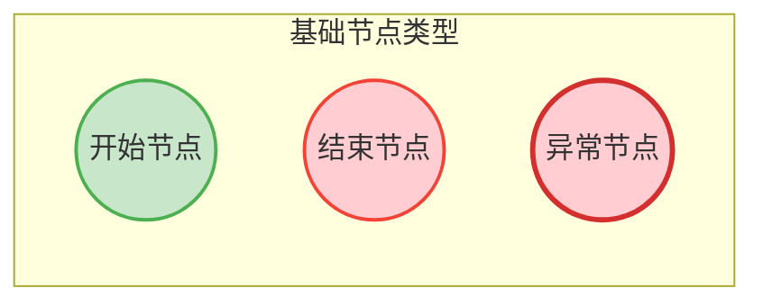

| 节点类型             | 图形表示           | 颜色    | 用途             |
| -------------------- | ------------------ | ------- | ---------------- |
| 开始节点 (Begin)     | 绿色圆形           | #c8e6c9 | 流程的唯一入口点 |
| 结束节点 (End)       | 红色圆形           | #ffcdd2 | 流程的正常出口点 |
| 异常节点 (Exception) | 红色圆形（粗边框） | #ffcdd2 | 异常情况的出口点 |

### 处理节点

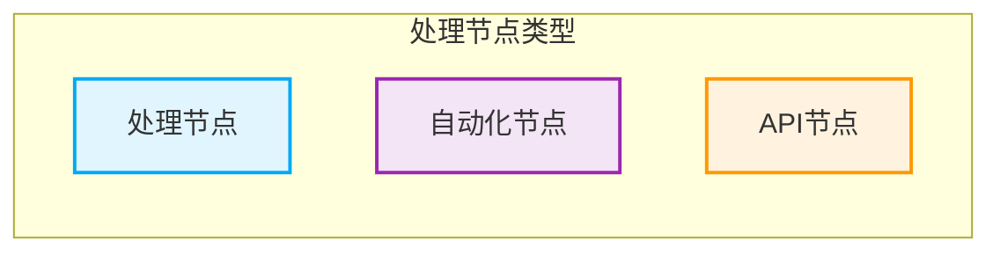

| 节点类型           | 图形表示 | 颜色    | 用途           |
| ------------------ | -------- | ------- | -------------- |
| 处理节点 (Process) | 蓝色矩形 | #e1f5fe | 执行业务逻辑   |
| 自动化节点 (Auto)  | 紫色矩形 | #f3e5f5 | 自动化任务执行 |
| API节点 (API)      | 橙色矩形 | #fff3e0 | 外部API调用    |

### 控制流节点

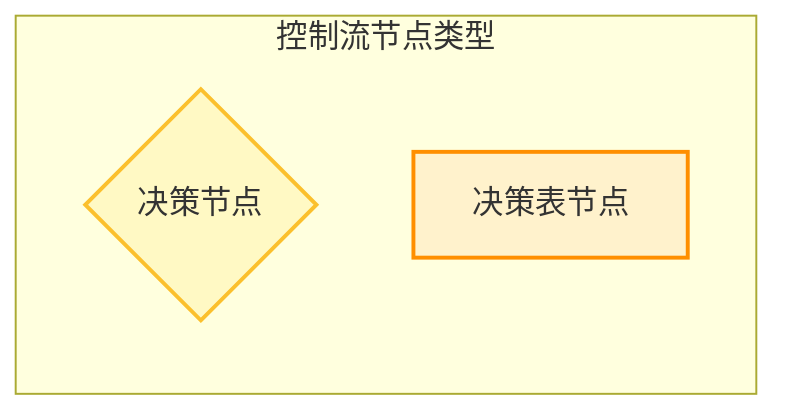

| 节点类型                    | 图形表示 | 颜色    | 用途         |
| --------------------------- | -------- | ------- | ------------ |
| 决策节点 (Decision)         | 黄色菱形 | #fff9c4 | 条件分支判断 |
| 决策表节点 (Decision Table) | 黄色矩形 | #fff2cc | 复杂规则判断 |

### 高级节点

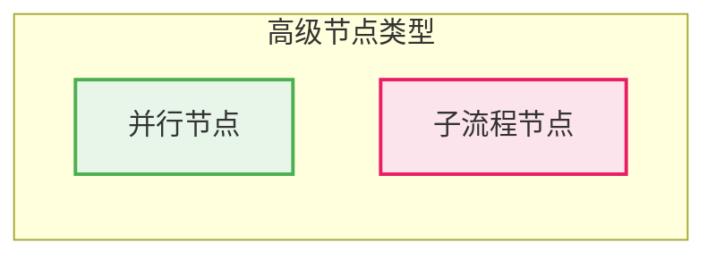

| 节点类型                | 图形表示 | 颜色    | 用途              |
| ----------------------- | -------- | ------- | ----------------- |
| 并行节点 (Concurrent)   | 绿色矩形 | #e8f5e9 | 并行处理开始/结束 |
| 子流程节点 (Subprocess) | 粉色矩形 | #fce4ec | 引用其他工作流程  |

## 连接线类型图例

### 基本连接线

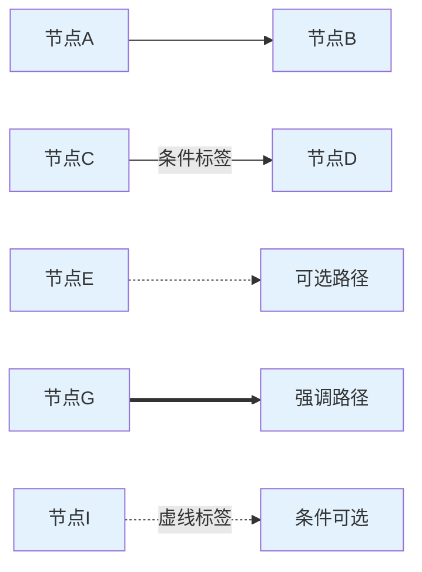

| 连接线类型 | 表示方法 | 用途           |
| ---------- | -------- | -------------- | --- | ------------ |
| 实线箭头   | `-->`    | 标准流程连接   |
| 带标签实线 | `-->     | 标签           | `   | 条件分支连接 |
| 虚线箭头   | `-.->`   | 可选或异常路径 |
| 粗线箭头   | `==>`    | 强调的重要路径 |
| 带标签虚线 | `-.->    | 标签           | `   | 条件可选路径 |

### 并行连接示例

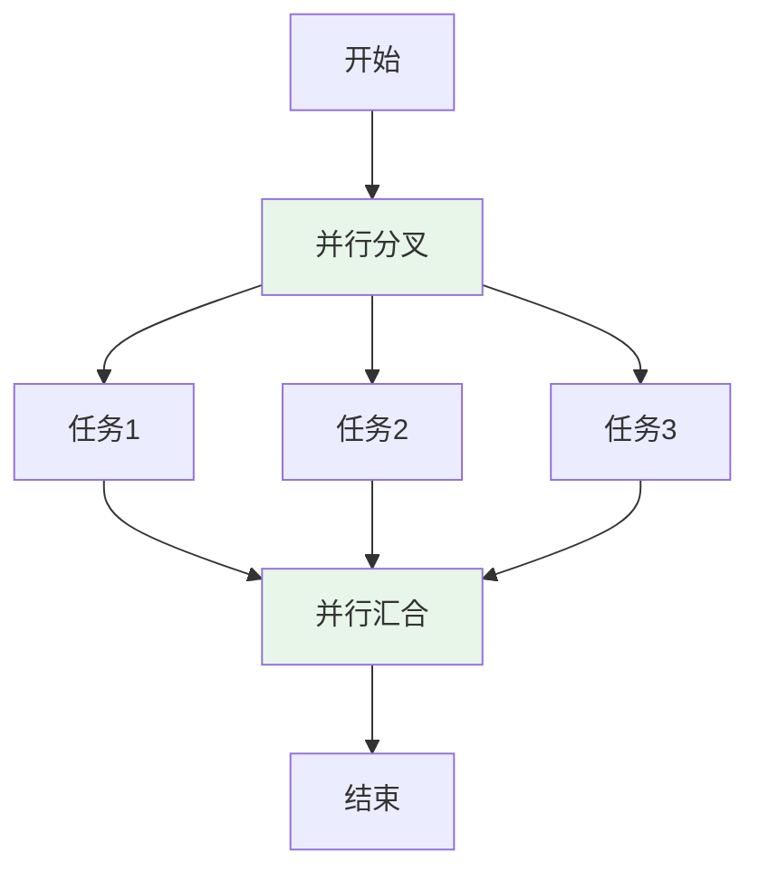

## 颜色编码规范

### 节点状态颜色

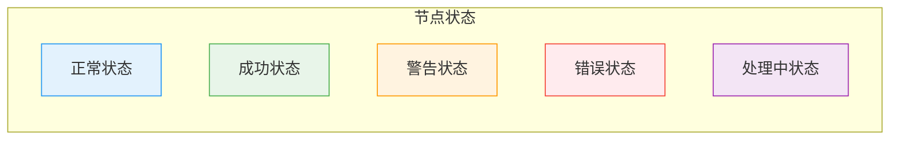

| 状态   | 颜色             | 含义           |
| ------ | ---------------- | -------------- |
| 正常   | 蓝色系 (#e3f2fd) | 标准业务节点   |
| 成功   | 绿色系 (#e8f5e9) | 成功完成的节点 |
| 警告   | 橙色系 (#fff3e0) | 需要注意的节点 |
| 错误   | 红色系 (#ffebee) | 错误或异常节点 |
| 处理中 | 紫色系 (#f3e5f5) | 正在执行的节点 |

### 优先级颜色

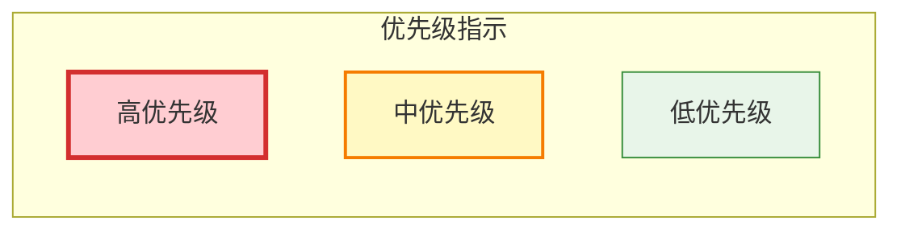

## 泳道设计规范

### 标准泳道颜色

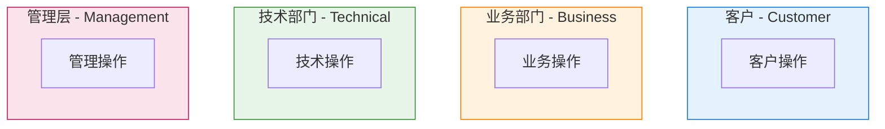

| 泳道类型 | 颜色             | 适用角色                   |
| -------- | ---------------- | -------------------------- |
| 客户泳道 | 浅蓝色 (#e3f2fd) | 客户、用户、外部实体       |
| 业务泳道 | 浅橙色 (#fff3e0) | 销售、市场、客服等业务部门 |
| 技术泳道 | 浅绿色 (#e8f5e9) | 开发、运维、技术支持       |
| 管理泳道 | 浅粉色 (#fce4ec) | 管理层、审批人员           |

## 状态指示器

### 执行状态

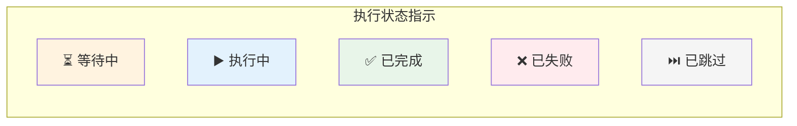

### 图标含义

| 图标 | 含义   | 使用场景       |
| ---- | ------ | -------------- |
| ⏳   | 等待中 | 节点等待执行   |
| ▶️   | 执行中 | 节点正在执行   |
| ✅   | 已完成 | 节点成功完成   |
| ❌   | 已失败 | 节点执行失败   |
| ⏭️   | 已跳过 | 节点被跳过     |
| ⚠️   | 警告   | 节点有警告信息 |
| 🔄   | 重试中 | 节点正在重试   |
| ⏸️   | 已暂停 | 节点执行暂停   |

## 复杂流程示例

### 完整示例：审批流程

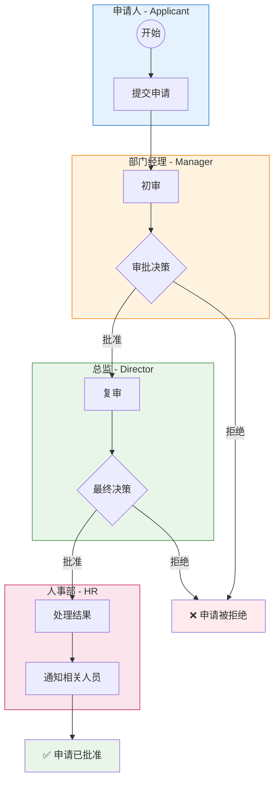

## 最佳实践

### 图表设计原则

1. **一致性**：在同一个工作流程中保持颜色和符号的一致性
2. **清晰性**：使用对比鲜明的颜色，确保图表易于阅读
3. **简洁性**：避免过多的颜色和复杂的图形元素
4. **可访问性**：考虑色盲用户，不仅依赖颜色区分元素

### 命名规范

- 节点名称：使用动词+名词的形式，如"处理订单"、"发送通知"
- 连接线标签：使用简洁的条件描述，如"成功"、"失败"、"超时"
- 泳道名称：使用角色或部门名称，如"客户"、"销售部"

### 布局建议

- 从左到右的主流程方向
- 异常处理放在主流程下方
- 并行分支垂直排列
- 泳道水平分布

## 相关文档

- [DSL 语法参考](./DSL-Reference.md)
- [节点类型使用指南](./Node-Types-Guide.md)
- [最佳实践和设计模式](./Best-Practices.md)
- [快速开始指南](./Quick-Start.md)
