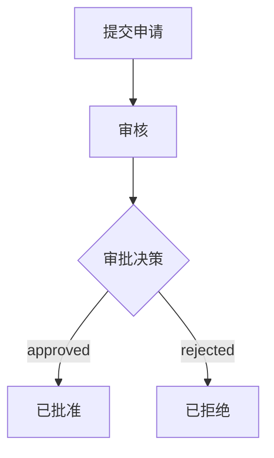
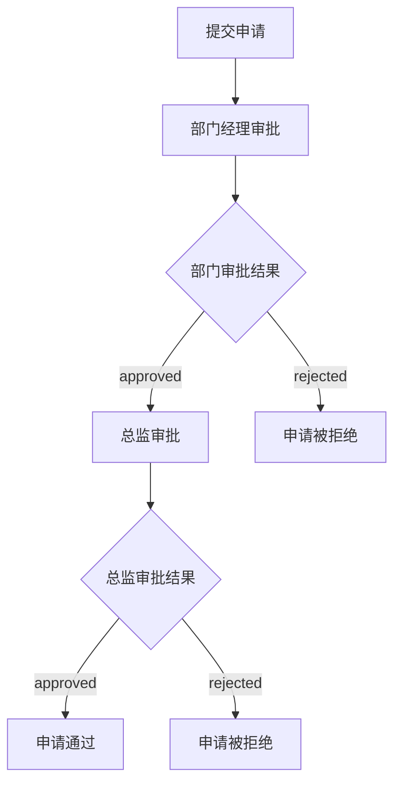
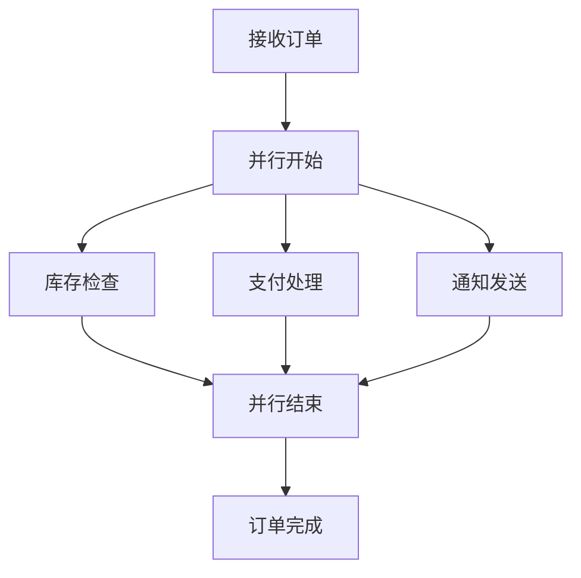
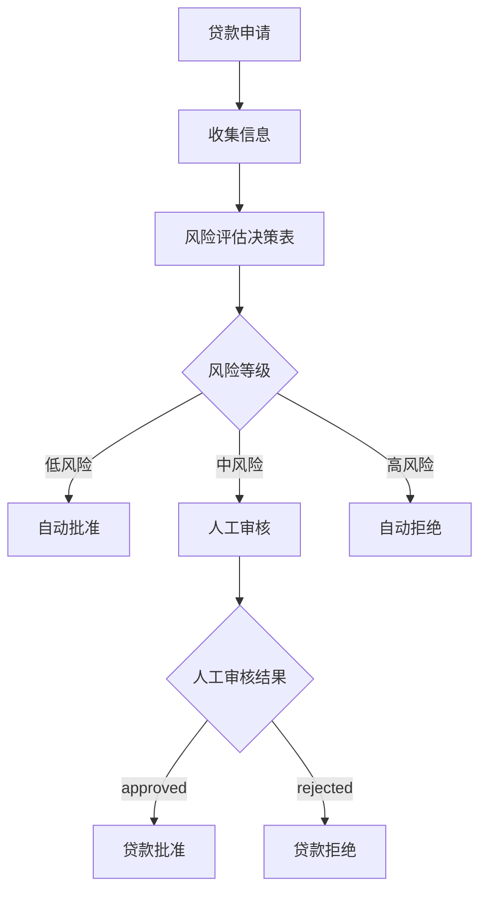

# 节点类型使用指南

本文档详细介绍了业务流程建模系统中各种节点类型的使用方法和最佳实践。

## 目录

- [节点概述](#节点概述)
- [基础节点](#基础节点)
- [控制流节点](#控制流节点)
- [高级节点](#高级节点)
- [节点属性配置](#节点属性配置)
- [常见使用场景](#常见使用场景)

## 节点概述

工作流程建模系统支持以下节点类型：

| 类别       | 节点类型                          | 用途             |
| ---------- | --------------------------------- | ---------------- |
| 基础节点   | begin, end, exception             | 流程的开始和结束 |
| 处理节点   | process                           | 执行具体业务逻辑 |
| 控制流节点 | decision, decision_table          | 条件分支和决策   |
| 高级节点   | subprocess, concurrent, auto, api | 复杂流程处理     |

## 基础节点

### 开始节点 (Begin)

开始节点是每个工作流程的入口点。

**图形表示：** 绿色圆形

**使用场景：**

- 标识流程的起始点
- 接收流程的初始输入数据

**示例：**

```yaml
- begin:
     id: start_node
     name: '接收订单'
     description: '接收客户提交的订单信息'
     position:
        x: 100
        y: 200
```

**注意事项：**

- 每个工作流程必须有且只有一个开始节点
- 开始节点不能有入边
- 开始节点只能有一条出边

### 结束节点 (End)

结束节点表示工作流程的正常终止点。

**图形表示：** 红色圆形（带边框）

**使用场景：**

- 标识流程的正常结束
- 返回流程执行结果

**示例：**

```yaml
- end:
     id: success_end
     name: '订单完成'
     description: '订单处理成功完成'
     expectedValue: 'completed'
     position:
        x: 800
        y: 200
```

**注意事项：**

- 一个工作流程可以有多个结束节点
- 必须指定 `expectedValue` 属性
- 结束节点不能有出边

### 异常节点 (Exception)

异常节点是特殊的结束节点，用于处理异常情况。

**图形表示：** 红色圆形（带叉号）

**使用场景：**

- 处理流程执行中的错误
- 标识异常终止路径

**示例：**

```yaml
- exception:
     id: error_end
     name: '处理失败'
     description: '订单处理过程中发生错误'
     expectedValue: 'error'
     errorCode: 'ERR_001'
     position:
        x: 800
        y: 400
```

**注意事项：**

- 建议为每种可能的异常情况创建单独的异常节点
- 使用 `errorCode` 便于错误追踪和处理

## 处理节点

### 过程节点 (Process)

过程节点是最常用的节点类型，用于执行具体的业务逻辑。

**图形表示：** 蓝色矩形

**使用场景：**

- 执行数据处理
- 调用业务服务
- 执行计算逻辑

**示例：**

```yaml
- process:
     id: validate_data
     name: '数据验证'
     description: '验证输入数据的完整性和有效性'
     position:
        x: 300
        y: 200
```

**注意事项：**

- 过程节点只能有一条出边
- 建议为每个过程节点添加清晰的描述

## 控制流节点

### 分支节点 (Decision)

分支节点用于根据条件进行流程分支。

**图形表示：** 黄色菱形

**使用场景：**

- 条件判断
- 多路径选择
- 审批决策

**示例：**

```yaml
- decision:
     id: approval_check
     name: '审批决策'
     description: '根据审批结果决定下一步'
     position:
        x: 500
        y: 200
     branches:
        - id: approved
          value: 'approved'
        - id: rejected
          value: 'rejected'
          isDefault: true
        - id: pending
          value: 'pending'
```

**最佳实践：**

- 始终设置一个默认分支（`isDefault: true`）
- 分支值应该清晰明确
- 避免过多的分支（建议不超过5个）

### 决策表节点 (Decision Table)

决策表节点用于处理复杂的多条件决策逻辑。

**图形表示：** 带表格图标的矩形

**使用场景：**

- 复杂的业务规则
- 多条件组合判断
- 风险评估
- 价格计算

**示例：**

```yaml
- decision_table:
     id: risk_assessment
     name: '风险评估'
     description: '基于多个因素评估风险等级'
     position:
        x: 500
        y: 200
     tableData:
        inputColumns:
           - id: credit_score
             name: '信用评分'
             dataType: 'number'
           - id: income
             name: '年收入'
             dataType: 'number'
        outputColumns:
           - id: risk_level
             name: '风险等级'
             dataType: 'string'
        decisionColumns:
           - id: decision
             name: '决策'
             dataType: 'string'
        rows:
           - id: row_1
             values:
                - column: credit_score
                  value: '>=750'
                - column: income
                  value: '>=100000'
                - column: risk_level
                  value: '低'
                - column: decision
                  value: 'approve'
           - id: row_2
             values:
                - column: credit_score
                  value: '<650'
                - column: income
                  value: '*'
                - column: risk_level
                  value: '高'
                - column: decision
                  value: 'reject'
```

**决策表设计原则：**

1. 输入列定义判断条件
2. 输出列定义结果值
3. 决策列定义最终决策
4. 每行代表一个规则
5. 使用 `*` 表示任意值

**注意事项：**

- 决策列的值不能完全相同
- 系统会根据决策列的唯一值自动创建输出边
- 建议按优先级排列规则行

## 高级节点

### 子流程节点 (Subprocess)

子流程节点用于嵌套引用其他工作流程，实现流程的模块化。

**图形表示：** 带加号的矩形

**使用场景：**

- 复用已有的工作流程
- 模块化复杂流程
- 分层设计

**示例：**

```yaml
- subprocess:
     id: payment_subprocess
     name: '支付处理'
     description: '调用支付处理子流程'
     referencePath: './payment/PaymentProcess.workflow.cm'
     position:
        x: 500
        y: 200
```

**最佳实践：**

- 将可复用的流程逻辑抽取为子流程
- 使用相对路径引用子流程
- 确保子流程的输入输出接口清晰

### 并发节点 (Concurrent)

并发节点用于处理可以并行执行的流程分支。

**图形表示：** 带平行线的矩形

**使用场景：**

- 并行处理多个独立任务
- 提高流程执行效率
- 处理无顺序依赖的操作

**示例：**

```yaml
# 并发开始节点
- concurrent:
     id: parallel_start
     name: '并行处理开始'
     description: '开始并行执行多个任务'
     position:
        x: 400
        y: 200
     parallelBranches:
        - id: branch_1
          name: '库存检查'
        - id: branch_2
          name: '支付处理'
        - id: branch_3
          name: '通知发送'

# 并发结束节点
- concurrent:
     id: parallel_end
     name: '并行处理结束'
     description: '等待所有并行任务完成'
     position:
        x: 800
        y: 200
```

**并发流程设计原则：**

1. 并发开始和结束节点必须成对出现
2. 所有并行分支必须最终汇聚到并发结束节点
3. 并发流程内部不能包含环路
4. 并发流程内部不能包含开始或结束节点

**注意事项：**

- 确保并行分支之间没有数据依赖
- 考虑并行执行的资源消耗
- 合理设计分支数量

### Auto 节点

Auto 节点用于自动化对接，执行预定义的自动化任务。

**图形表示：** 带齿轮图标的矩形

**使用场景：**

- 自动化脚本执行
- 定时任务触发
- 系统集成

**示例：**

```yaml
- auto:
     id: auto_notification
     name: '自动通知'
     description: '自动发送通知邮件'
     automationType: 'email'
     configuration:
        template: 'order_confirmation'
        recipients: ['${customer.email}']
     position:
        x: 600
        y: 200
```

### API 节点

API 节点用于调用外部 API 接口。

**图形表示：** 带云图标的矩形

**使用场景：**

- 调用外部服务
- 数据同步
- 第三方系统集成

**示例：**

```yaml
- api:
     id: payment_api
     name: '支付接口'
     description: '调用支付网关API'
     endpoint: 'https://api.payment.com/v1/charge'
     method: 'POST'
     headers:
        Authorization: 'Bearer ${api_token}'
        Content-Type: 'application/json'
     body:
        amount: '${order.amount}'
        currency: 'CNY'
        orderId: '${order.id}'
     position:
        x: 500
        y: 200
```

**API 节点配置：**

- `endpoint`: API 端点 URL
- `method`: HTTP 方法（GET, POST, PUT, DELETE）
- `headers`: 请求头
- `body`: 请求体（用于 POST/PUT）
- 支持使用 `${variable}` 语法引用流程变量

## 节点属性配置

### 通用属性

所有节点都支持以下通用属性：

| 属性        | 类型   | 描述               |
| ----------- | ------ | ------------------ |
| id          | string | 节点唯一标识符     |
| name        | string | 节点显示名称       |
| description | string | 节点描述信息       |
| position    | {x, y} | 图形编辑器中的位置 |

### 测试数据配置

可以为节点配置测试数据，用于流程测试和验证。

```yaml
- process:
     id: my_process
     name: '处理步骤'
     testData:
        - id: test_case_1
          name: '正常情况测试'
          inputData:
             orderId: 'ORD001'
             amount: 100
          expectedOutput:
             status: 'success'
          edgeBinding: edge_to_success
        - id: test_case_2
          name: '异常情况测试'
          inputData:
             orderId: ''
             amount: -1
          expectedOutput:
             status: 'error'
          edgeBinding: edge_to_error
```

### 自动化动作配置

可以为节点配置自动化动作，在节点执行时自动触发。

```yaml
- process:
     id: order_process
     name: '订单处理'
     automationActions:
        - id: log_action
          name: '记录日志'
          actionType: 'script'
          configuration:
             script: "console.log('Order processed:', orderId)"
          edgeBinding: edge_1
        - id: notify_action
          name: '发送通知'
          actionType: 'webhook'
          configuration:
             url: 'https://hooks.example.com/notify'
             payload:
                event: 'order_processed'
          edgeBinding: edge_1
```

## 常见使用场景

### 场景1：简单审批流程

**流程图可视化：**



```yaml
workflow:
   id: simple_approval
   name: '简单审批'
   nodes:
      - begin:
           id: submit
           name: '提交申请'
      - process:
           id: review
           name: '审核'
      - decision:
           id: decision
           name: '审批决策'
           branches:
              - id: approve
                value: 'approved'
              - id: reject
                value: 'rejected'
                isDefault: true
      - end:
           id: approved
           name: '已批准'
           expectedValue: 'approved'
      - end:
           id: rejected
           name: '已拒绝'
           expectedValue: 'rejected'
   edges:
      - edge:
           id: e1
           source: submit
           target: review
      - edge:
           id: e2
           source: review
           target: decision
      - edge:
           id: e3
           source: decision
           target: approved
           value: 'approved'
      - edge:
           id: e4
           source: decision
           target: rejected
           value: 'rejected'
```

### 场景2：多级审批流程

适用于需要多个审批人依次审批的场景。

**流程图可视化：**



### 场景3：并行处理流程

适用于多个任务可以同时执行的场景，如订单处理中的库存检查、支付处理和通知发送。

**流程图可视化：**



### 场景4：基于规则的决策流程

适用于需要根据多个条件进行复杂决策的场景，如贷款审批、风险评估等。

**流程图可视化：**



## 相关文档

- [DSL 语法参考](./DSL-Reference.md)
- [最佳实践和设计模式](./Best-Practices.md)
- [示例项目](../../examples/workflow-examples/)
- [工作流程图例说明](./Diagram-Legend.md)
