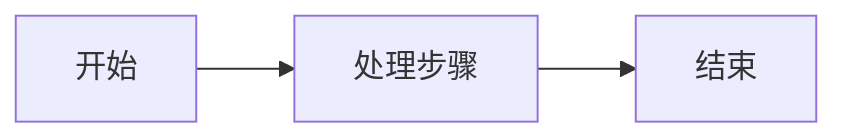
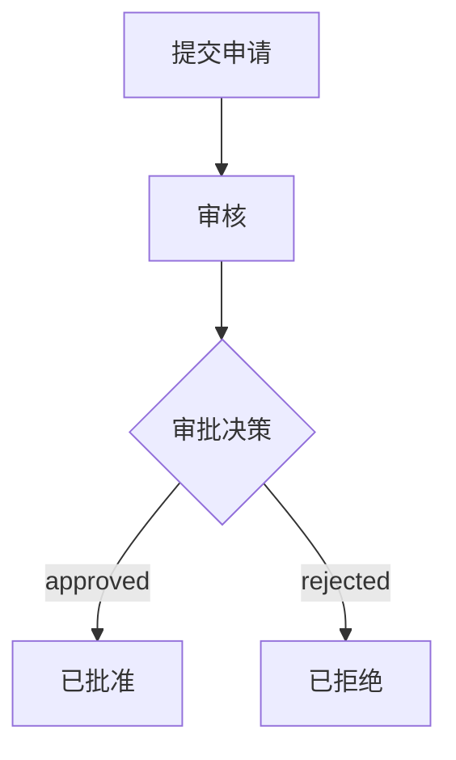

# 快速开始指南

本指南将帮助您快速上手业务流程建模系统，创建您的第一个工作流程。

## 目录

- [创建新项目](#创建新项目)
- [创建第一个工作流程](#创建第一个工作流程)
- [使用图形编辑器](#使用图形编辑器)
- [使用表单编辑器](#使用表单编辑器)
- [运行和测试](#运行和测试)
- [下一步](#下一步)

## 创建新项目

### 方法 1：使用项目向导

1. 打开应用程序
2. 点击 "文件" > "新建项目"
3. 选择 "工作流程项目" 模板
4. 输入项目名称和位置
5. 点击 "创建"

### 方法 2：手动创建

1. 创建项目目录：

```bash
mkdir my-workflow-project
cd my-workflow-project
```

2. 创建数据模型文件 `datamodel.cm`：

```yaml
datamodel:
   id: my_workflow_project
   name: '我的工作流程项目'
   type: logical
   version: 1.0.0
   description: '我的第一个工作流程项目'
```

3. 创建工作流程目录：

```bash
mkdir workflows
```

## 创建第一个工作流程

### 使用文本编辑器

1. 在 `workflows` 目录下创建文件 `MyFirstWorkflow.workflow.cm`

2. 输入以下内容：

```yaml
workflow:
   id: my_first_workflow
   name: '我的第一个工作流程'
   metadata:
      version: '1.0.0'
      author: 'Your Name'
      tags:
         - '示例'
         - '入门'
   nodes:
      - begin:
           id: start
           name: '开始'
           description: '流程开始'
           position:
              x: 100
              y: 200
      - process:
           id: step_1
           name: '处理步骤'
           description: '执行业务逻辑'
           position:
              x: 300
              y: 200
      - end:
           id: finish
           name: '结束'
           description: '流程结束'
           expectedValue: 'success'
           position:
              x: 500
              y: 200
   edges:
      - edge:
           id: edge_1
           source: start
           target: step_1
      - edge:
           id: edge_2
           source: step_1
           target: finish
```

3. 保存文件

### 理解工作流程结构

```
workflow:                    # 工作流程根元素
    id: ...                  # 唯一标识符
    name: ...                # 显示名称
    metadata:                # 元数据（可选）
        version: ...
        author: ...
        tags: [...]
    nodes:                   # 节点列表
        - begin: ...         # 开始节点
        - process: ...       # 过程节点
        - end: ...           # 结束节点
    edges:                   # 边列表
        - edge: ...          # 连接节点的边
```

**流程图可视化：**



## 使用图形编辑器

### 打开图形编辑器

1. 在文件浏览器中右键点击 `.workflow.cm` 文件
2. 选择 "使用图形编辑器打开"

### 添加节点

1. 在左侧工具面板中选择节点类型
2. 在画布上点击要放置节点的位置
3. 在弹出的对话框中输入节点属性

### 连接节点

1. 点击源节点的输出端口
2. 拖动到目标节点的输入端口
3. 释放鼠标完成连接

### 编辑节点

1. 双击节点打开属性面板
2. 修改节点属性
3. 点击 "保存" 或按 Ctrl+S

### 删除元素

1. 选中要删除的节点或边
2. 按 Delete 键或右键选择 "删除"

### 快捷键

| 快捷键 | 功能         |
| ------ | ------------ |
| Ctrl+S | 保存         |
| Ctrl+Z | 撤销         |
| Ctrl+Y | 重做         |
| Delete | 删除选中元素 |
| Ctrl+A | 全选         |
| Ctrl+C | 复制         |
| Ctrl+V | 粘贴         |

## 使用表单编辑器

### 打开表单编辑器

1. 在文件浏览器中右键点击 `.workflow.cm` 文件
2. 选择 "使用表单编辑器打开"

### 编辑工作流程属性

1. 在 "基本信息" 部分编辑工作流程名称、描述等
2. 在 "元数据" 部分编辑版本、作者、标签

### 管理节点

1. 在 "节点" 部分查看所有节点
2. 点击节点展开详细属性
3. 修改节点属性后自动保存

### 管理边

1. 在 "边" 部分查看所有连接
2. 可以修改边的条件值

## 创建带分支的工作流程

下面是一个带条件分支的审批流程示例：

**流程图可视化：**



**DSL 代码：**

```yaml
workflow:
   id: approval_workflow
   name: '审批流程'
   metadata:
      version: '1.0.0'
   nodes:
      - begin:
           id: submit
           name: '提交申请'
           position:
              x: 100
              y: 200
      - process:
           id: review
           name: '审核'
           position:
              x: 300
              y: 200
      - decision:
           id: decision
           name: '审批决策'
           position:
              x: 500
              y: 200
           branches:
              - id: approve
                value: 'approved'
              - id: reject
                value: 'rejected'
                isDefault: true
      - end:
           id: approved_end
           name: '已批准'
           expectedValue: 'approved'
           position:
              x: 700
              y: 100
      - end:
           id: rejected_end
           name: '已拒绝'
           expectedValue: 'rejected'
           position:
              x: 700
              y: 300
   edges:
      - edge:
           id: e1
           source: submit
           target: review
      - edge:
           id: e2
           source: review
           target: decision
      - edge:
           id: e3
           source: decision
           target: approved_end
           value: 'approved'
      - edge:
           id: e4
           source: decision
           target: rejected_end
           value: 'rejected'
```

## 运行和测试

### 验证工作流程

1. 保存工作流程文件
2. 系统会自动进行语法和语义验证
3. 查看 "问题" 面板中的错误和警告

### 常见验证错误

| 错误         | 原因                   | 解决方案             |
| ------------ | ---------------------- | -------------------- |
| 缺少开始节点 | 工作流程没有开始节点   | 添加一个开始节点     |
| 缺少结束节点 | 工作流程没有结束节点   | 添加至少一个结束节点 |
| 分支值重复   | 分支节点的输出边值相同 | 确保每个分支值唯一   |
| 节点未连接   | 存在孤立的节点         | 连接所有节点         |

### 配置测试数据

为节点添加测试数据：

```yaml
- process:
     id: calculate
     name: '计算'
     testData:
        - id: test_1
          name: '正常测试'
          inputData:
             value: 100
          expectedOutput:
             result: 200
          edgeBinding: edge_to_next
```

## 下一步

恭喜！您已经创建了第一个工作流程。接下来可以：

1. **学习更多节点类型**
   - 阅读 [节点类型使用指南](./Node-Types-Guide.md)
   - 尝试使用决策表、并发节点等高级功能

2. **探索示例项目**
   - 查看 `examples/workflow-examples/` 目录中的示例
   - 学习不同场景的工作流程设计

3. **深入了解 DSL**
   - 阅读 [DSL 语法参考](./DSL-Reference.md)
   - 掌握完整的语法规则

4. **学习最佳实践**
   - 阅读 [最佳实践和设计模式](./Best-Practices.md)
   - 了解如何设计高质量的工作流程

## 获取帮助

- 查看 [常见问题](./FAQ.md)
- 提交 [GitHub Issue](https://github.com/your-org/crossmodel/issues)
- 加入社区讨论

## 相关文档

- [DSL 语法参考](./DSL-Reference.md)
- [节点类型使用指南](./Node-Types-Guide.md)
- [最佳实践和设计模式](./Best-Practices.md)
