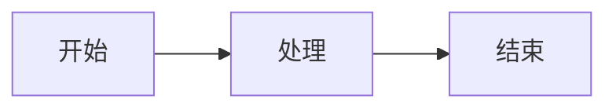
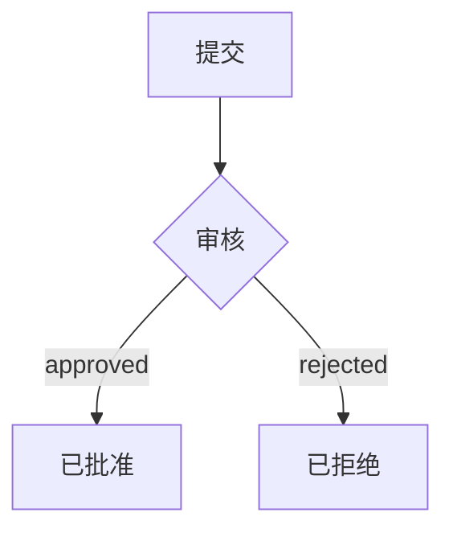
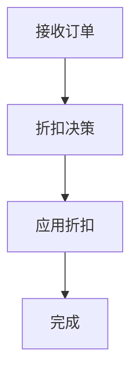
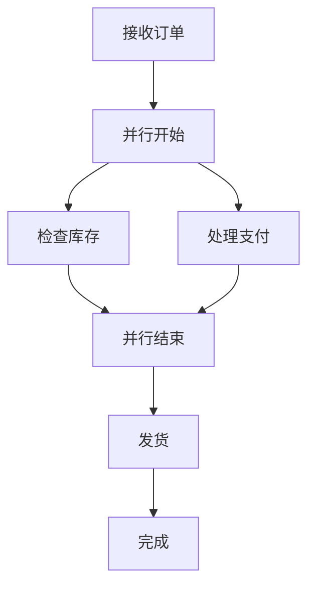
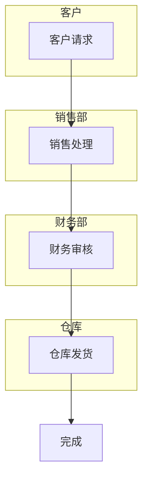
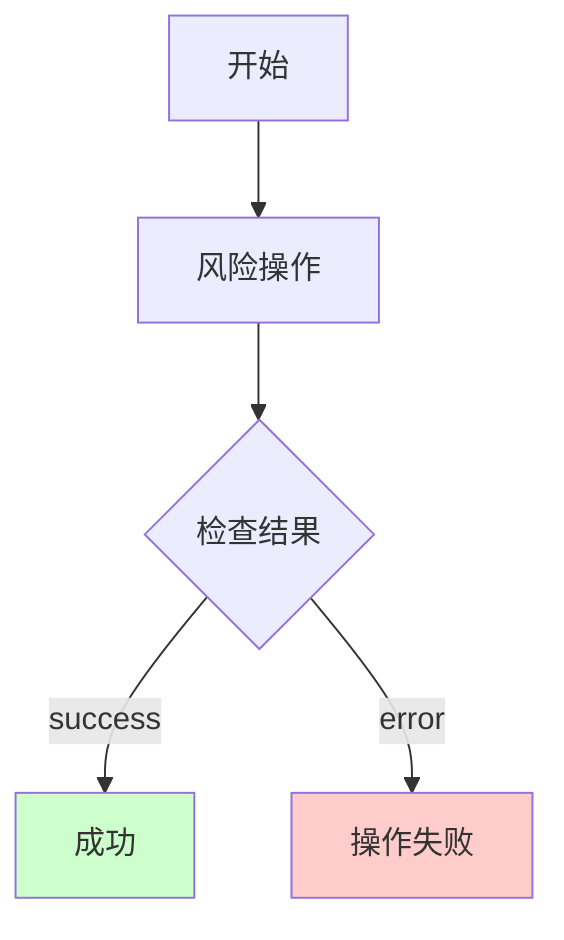
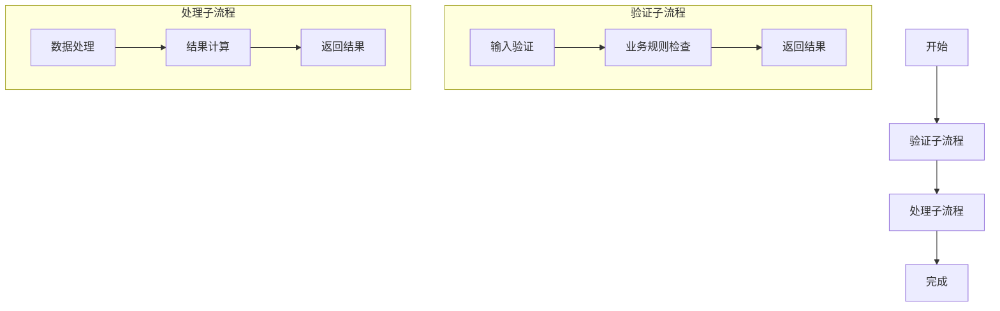

# 交互式教程

本教程将通过一系列实践练习，帮助您掌握业务流程建模系统的核心功能。

## 目录

- [教程 1：创建简单流程](#教程-1创建简单流程)
- [教程 2：添加条件分支](#教程-2添加条件分支)
- [教程 3：使用决策表](#教程-3使用决策表)
- [教程 4：并行处理](#教程-4并行处理)
- [教程 5：使用泳道](#教程-5使用泳道)
- [教程 6：错误处理](#教程-6错误处理)
- [教程 7：子流程和模块化](#教程-7子流程和模块化)

---

## 教程 1：创建简单流程

### 目标

创建一个简单的三步骤工作流程。

**流程图可视化：**



### 步骤

#### 步骤 1：创建项目

1. 创建新目录 `tutorial-project`
2. 创建 `datamodel.cm` 文件：

```yaml
datamodel:
   id: tutorial_project
   name: '教程项目'
   type: logical
   version: 1.0.0
   description: '学习工作流程建模的教程项目'
```

#### 步骤 2：创建工作流程文件

1. 创建 `workflows` 目录
2. 创建 `SimpleWorkflow.workflow.cm` 文件

#### 步骤 3：定义工作流程

```yaml
workflow:
   id: simple_workflow
   name: '简单工作流程'
   metadata:
      version: '1.0.0'
   nodes:
      - begin:
           id: start
           name: '开始'
           position:
              x: 100
              y: 200
      - process:
           id: process_step
           name: '处理'
           position:
              x: 300
              y: 200
      - end:
           id: finish
           name: '结束'
           expectedValue: 'done'
           position:
              x: 500
              y: 200
   edges:
      - edge:
           id: e1
           source: start
           target: process_step
      - edge:
           id: e2
           source: process_step
           target: finish
```

#### 步骤 4：验证

保存文件，检查是否有验证错误。

### 练习

1. 添加第二个过程节点
2. 为每个节点添加描述
3. 尝试使用图形编辑器查看流程

---

## 教程 2：添加条件分支

### 目标

创建一个带有条件分支的审批流程。

**流程图可视化：**



### 步骤

#### 步骤 1：创建基础结构

```yaml
workflow:
   id: approval_flow
   name: '审批流程'
   nodes:
      - begin:
           id: submit
           name: '提交'
           position:
              x: 100
              y: 200
```

#### 步骤 2：添加分支节点

```yaml
- decision:
     id: review
     name: '审核'
     position:
        x: 300
        y: 200
     branches:
        - id: approve
          value: 'approved'
        - id: reject
          value: 'rejected'
          isDefault: true
```

#### 步骤 3：添加结束节点

```yaml
- end:
     id: approved_end
     name: '已批准'
     expectedValue: 'approved'
     position:
        x: 500
        y: 100
- end:
     id: rejected_end
     name: '已拒绝'
     expectedValue: 'rejected'
     position:
        x: 500
        y: 300
```

#### 步骤 4：连接节点

```yaml
edges:
   - edge:
        id: e1
        source: submit
        target: review
   - edge:
        id: e2
        source: review
        target: approved_end
        value: 'approved'
   - edge:
        id: e3
        source: review
        target: rejected_end
        value: 'rejected'
```

### 完整代码

```yaml
workflow:
   id: approval_flow
   name: '审批流程'
   metadata:
      version: '1.0.0'
   nodes:
      - begin:
           id: submit
           name: '提交'
           position:
              x: 100
              y: 200
      - decision:
           id: review
           name: '审核'
           position:
              x: 300
              y: 200
           branches:
              - id: approve
                value: 'approved'
              - id: reject
                value: 'rejected'
                isDefault: true
      - end:
           id: approved_end
           name: '已批准'
           expectedValue: 'approved'
           position:
              x: 500
              y: 100
      - end:
           id: rejected_end
           name: '已拒绝'
           expectedValue: 'rejected'
           position:
              x: 500
              y: 300
   edges:
      - edge:
           id: e1
           source: submit
           target: review
      - edge:
           id: e2
           source: review
           target: approved_end
           value: 'approved'
      - edge:
           id: e3
           source: review
           target: rejected_end
           value: 'rejected'
```

### 练习

1. 添加第三个分支 "pending"（待定）
2. 在分支前添加一个处理节点
3. 尝试让两个分支最终汇聚到同一个结束节点

---

## 教程 3：使用决策表

### 目标

创建一个使用决策表进行复杂决策的流程。

### 场景

根据客户等级和订单金额决定折扣率。

### 步骤

#### 步骤 1：定义决策表节点

```yaml
- decision_table:
     id: discount_decision
     name: '折扣决策'
     position:
        x: 300
        y: 200
     tableData:
        inputColumns:
           - id: customer_level
             name: '客户等级'
             dataType: 'string'
           - id: order_amount
             name: '订单金额'
             dataType: 'number'
        outputColumns:
           - id: discount_rate
             name: '折扣率'
             dataType: 'number'
        decisionColumns:
           - id: decision
             name: '决策'
             dataType: 'string'
        rows:
           - id: row_1
             values:
                - column: customer_level
                  value: 'VIP'
                - column: order_amount
                  value: '>=1000'
                - column: discount_rate
                  value: '20'
                - column: decision
                  value: 'high_discount'
           - id: row_2
             values:
                - column: customer_level
                  value: 'VIP'
                - column: order_amount
                  value: '<1000'
                - column: discount_rate
                  value: '15'
                - column: decision
                  value: 'medium_discount'
           - id: row_3
             values:
                - column: customer_level
                  value: '普通'
                - column: order_amount
                  value: '>=1000'
                - column: discount_rate
                  value: '10'
                - column: decision
                  value: 'low_discount'
           - id: row_4
             values:
                - column: customer_level
                  value: '普通'
                - column: order_amount
                  value: '<1000'
                - column: discount_rate
                  value: '0'
                - column: decision
                  value: 'no_discount'
```

### 完整流程

**流程图可视化：**



**DSL 代码：**

```yaml
workflow:
   id: discount_workflow
   name: '折扣计算流程'
   metadata:
      version: '1.0.0'
   nodes:
      - begin:
           id: start
           name: '接收订单'
           position:
              x: 100
              y: 200
      - decision_table:
           id: discount_decision
           name: '折扣决策'
           position:
              x: 300
              y: 200
           tableData:
              inputColumns:
                 - id: customer_level
                   name: '客户等级'
                   dataType: 'string'
                 - id: order_amount
                   name: '订单金额'
                   dataType: 'number'
              outputColumns:
                 - id: discount_rate
                   name: '折扣率'
                   dataType: 'number'
              decisionColumns:
                 - id: decision
                   name: '决策'
                   dataType: 'string'
              rows:
                 - id: row_1
                   values:
                      - column: customer_level
                        value: 'VIP'
                      - column: order_amount
                        value: '>=1000'
                      - column: discount_rate
                        value: '20'
                      - column: decision
                        value: 'high_discount'
                 - id: row_2
                   values:
                      - column: customer_level
                        value: 'VIP'
                      - column: order_amount
                        value: '<1000'
                      - column: discount_rate
                        value: '15'
                      - column: decision
                        value: 'medium_discount'
                 - id: row_3
                   values:
                      - column: customer_level
                        value: '普通'
                      - column: order_amount
                        value: '>=1000'
                      - column: discount_rate
                        value: '10'
                      - column: decision
                        value: 'low_discount'
                 - id: row_4
                   values:
                      - column: customer_level
                        value: '普通'
                      - column: order_amount
                        value: '<1000'
                      - column: discount_rate
                        value: '0'
                      - column: decision
                        value: 'no_discount'
      - process:
           id: apply_discount
           name: '应用折扣'
           position:
              x: 500
              y: 200
      - end:
           id: finish
           name: '完成'
           expectedValue: 'done'
           position:
              x: 700
              y: 200
   edges:
      - edge:
           id: e1
           source: start
           target: discount_decision
      - edge:
           id: e2
           source: discount_decision
           target: apply_discount
           value: 'high_discount'
      - edge:
           id: e3
           source: discount_decision
           target: apply_discount
           value: 'medium_discount'
      - edge:
           id: e4
           source: discount_decision
           target: apply_discount
           value: 'low_discount'
      - edge:
           id: e5
           source: discount_decision
           target: apply_discount
           value: 'no_discount'
      - edge:
           id: e6
           source: apply_discount
           target: finish
```

### 练习

1. 添加新的客户等级 "黄金会员"
2. 添加新的输入条件 "是否首单"
3. 尝试使用表单编辑器编辑决策表

---

## 教程 4：并行处理

### 目标

创建一个包含并行处理的订单处理流程。

**流程图可视化：**



### 完整代码

```yaml
workflow:
   id: parallel_order
   name: '并行订单处理'
   metadata:
      version: '1.0.0'
   nodes:
      - begin:
           id: receive_order
           name: '接收订单'
           position:
              x: 100
              y: 200
      - concurrent:
           id: parallel_start
           name: '并行开始'
           position:
              x: 300
              y: 200
           parallelBranches:
              - id: inventory_branch
                name: '库存处理'
              - id: payment_branch
                name: '支付处理'
      - process:
           id: check_inventory
           name: '检查库存'
           position:
              x: 500
              y: 100
      - process:
           id: process_payment
           name: '处理支付'
           position:
              x: 500
              y: 300
      - concurrent:
           id: parallel_end
           name: '并行结束'
           position:
              x: 700
              y: 200
      - process:
           id: ship_order
           name: '发货'
           position:
              x: 900
              y: 200
      - end:
           id: complete
           name: '完成'
           expectedValue: 'done'
           position:
              x: 1100
              y: 200
   edges:
      - edge:
           id: e1
           source: receive_order
           target: parallel_start
      - edge:
           id: e2
           source: parallel_start
           target: check_inventory
      - edge:
           id: e3
           source: parallel_start
           target: process_payment
      - edge:
           id: e4
           source: check_inventory
           target: parallel_end
      - edge:
           id: e5
           source: process_payment
           target: parallel_end
      - edge:
           id: e6
           source: parallel_end
           target: ship_order
      - edge:
           id: e7
           source: ship_order
           target: complete
```

### 练习

1. 添加第三个并行分支 "发送通知"
2. 在每个并行分支中添加更多步骤
3. 尝试在并行分支中添加条件判断

---

## 教程 5：使用泳道

### 目标

使用泳道组织多角色参与的流程。

**流程图可视化：**



### 完整代码

```yaml
workflow:
   id: swimlane_workflow
   name: '多角色流程'
   metadata:
      version: '1.0.0'
   nodes:
      - begin:
           id: customer_request
           name: '客户请求'
           position:
              x: 150
              y: 100
      - process:
           id: sales_process
           name: '销售处理'
           position:
              x: 350
              y: 100
      - process:
           id: finance_review
           name: '财务审核'
           position:
              x: 550
              y: 250
      - process:
           id: warehouse_ship
           name: '仓库发货'
           position:
              x: 750
              y: 400
      - end:
           id: complete
           name: '完成'
           expectedValue: 'done'
           position:
              x: 950
              y: 250
   edges:
      - edge:
           id: e1
           source: customer_request
           target: sales_process
      - edge:
           id: e2
           source: sales_process
           target: finance_review
      - edge:
           id: e3
           source: finance_review
           target: warehouse_ship
      - edge:
           id: e4
           source: warehouse_ship
           target: complete
   swimlanes:
      - swimlane:
           id: customer_lane
           name: '客户'
           position:
              x: 100
              y: 50
           width: 200
           height: 100
           color: '#E3F2FD'
           containedNodes:
              - ref: customer_request
      - swimlane:
           id: sales_lane
           name: '销售部'
           position:
              x: 300
              y: 50
           width: 200
           height: 100
           color: '#FFF3E0'
           containedNodes:
              - ref: sales_process
      - swimlane:
           id: finance_lane
           name: '财务部'
           position:
              x: 500
              y: 200
           width: 200
           height: 100
           color: '#E8F5E9'
           containedNodes:
              - ref: finance_review
      - swimlane:
           id: warehouse_lane
           name: '仓库'
           position:
              x: 700
              y: 350
           width: 200
           height: 100
           color: '#FCE4EC'
           containedNodes:
              - ref: warehouse_ship
```

### 练习

1. 添加新的角色和泳道
2. 尝试让一个节点跨越多个泳道
3. 调整泳道的颜色和大小

---

## 教程 6：错误处理

### 目标

学习如何在流程中处理错误和异常。

**流程图可视化：**



### 完整代码

```yaml
workflow:
   id: error_handling
   name: '错误处理流程'
   metadata:
      version: '1.0.0'
   nodes:
      - begin:
           id: start
           name: '开始'
           position:
              x: 100
              y: 200
      - process:
           id: risky_operation
           name: '风险操作'
           position:
              x: 300
              y: 200
      - decision:
           id: check_result
           name: '检查结果'
           position:
              x: 500
              y: 200
           branches:
              - id: success
                value: 'success'
              - id: error
                value: 'error'
                isDefault: true
      - end:
           id: success_end
           name: '成功'
           expectedValue: 'success'
           position:
              x: 700
              y: 100
      - exception:
           id: error_end
           name: '操作失败'
           expectedValue: 'error'
           errorCode: 'ERR_OPERATION'
           position:
              x: 700
              y: 300
   edges:
      - edge:
           id: e1
           source: start
           target: risky_operation
      - edge:
           id: e2
           source: risky_operation
           target: check_result
      - edge:
           id: e3
           source: check_result
           target: success_end
           value: 'success'
      - edge:
           id: e4
           source: check_result
           target: error_end
           value: 'error'
```

### 练习

1. 添加重试逻辑
2. 添加多种类型的异常节点
3. 实现补偿事务模式

---

## 教程 7：子流程和模块化

### 目标

学习如何使用子流程实现流程的模块化。

**流程图可视化：**



### 主流程

```yaml
workflow:
   id: main_flow
   name: '主流程'
   nodes:
      - begin:
           id: start
           name: '开始'
           position:
              x: 100
              y: 200
      - subprocess:
           id: validation_sub
           name: '验证子流程'
           referencePath: './ValidationSubprocess.workflow.cm'
           position:
              x: 300
              y: 200
      - subprocess:
           id: processing_sub
           name: '处理子流程'
           referencePath: './ProcessingSubprocess.workflow.cm'
           position:
              x: 500
              y: 200
      - end:
           id: finish
           name: '完成'
           expectedValue: 'done'
           position:
              x: 700
              y: 200
   edges:
      - edge:
           id: e1
           source: start
           target: validation_sub
      - edge:
           id: e2
           source: validation_sub
           target: processing_sub
      - edge:
           id: e3
           source: processing_sub
           target: finish
```

### 练习

1. 创建验证子流程
2. 创建处理子流程
3. 尝试在子流程中使用条件分支

---

## 总结

通过这些教程，您已经学习了：

1. ✅ 创建基本工作流程
2. ✅ 使用条件分支
3. ✅ 使用决策表处理复杂决策
4. ✅ 实现并行处理
5. ✅ 使用泳道组织流程
6. ✅ 处理错误和异常
7. ✅ 使用子流程实现模块化

## 下一步

- 阅读 [DSL 语法参考](./DSL-Reference.md) 了解完整语法
- 阅读 [最佳实践](./Best-Practices.md) 学习设计模式
- 查看 [示例项目](../../examples/workflow-examples/) 获取更多灵感

## 相关文档

- [快速开始指南](./Quick-Start.md)
- [节点类型使用指南](./Node-Types-Guide.md)
- [API 参考文档](./API-Reference.md)
- [工作流程图例说明](./Diagram-Legend.md)
