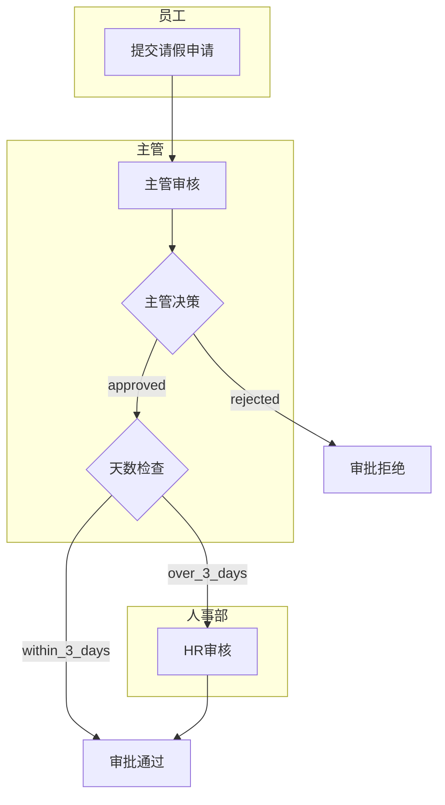

# 请假审批流程示例

这是一个完整的请假审批工作流程示例，展示了条件分支、多角色协作和泳道的使用。

## 流程概述

该示例演示了一个典型的企业请假审批流程，包含员工申请、主管审核、天数检查和HR审核等环节。

**流程图可视化：**



## 文件结构

```
approval-workflow/
├── datamodel.cm                    # 数据模型定义
└── workflows/
    └── LeaveApproval.workflow.cm   # 请假审批流程定义
```

## 工作流程详情

### 节点说明

1. **提交请假申请** (`submit_request`)
   - 员工提交请假申请
   - 流程的起始点

2. **主管审核** (`manager_review`)
   - 直属主管审核请假申请
   - 检查申请的合理性

3. **主管决策** (`manager_decision`)
   - 主管决定是否批准申请
   - 分支：approved / rejected

4. **天数检查** (`days_check`)
   - 检查请假天数是否超过3天
   - 分支：over_3_days / within_3_days

5. **HR审核** (`hr_review`)
   - 人事部门审核长假申请（>3天）
   - 最终审核环节

6. **审批通过** (`approved_end`)
   - 请假申请获得批准

7. **审批拒绝** (`rejected_end`)
   - 请假申请被拒绝

### 泳道设计

- **员工泳道**：包含申请提交节点
- **主管泳道**：包含审核、决策和天数检查节点
- **人事部泳道**：包含HR审核节点

### 流程路径

1. **正常短假路径**：
   提交申请 → 主管审核 → 主管批准 → 天数检查(≤3天) → 审批通过

2. **长假路径**：
   提交申请 → 主管审核 → 主管批准 → 天数检查(>3天) → HR审核 → 审批通过

3. **拒绝路径**：
   提交申请 → 主管审核 → 主管拒绝 → 审批拒绝

## 业务规则

- 所有请假申请必须经过直属主管审核
- 主管可以直接拒绝申请
- 超过3天的请假需要HR部门额外审核
- 3天以内的请假主管批准后即可通过

## 使用方法

1. 在 CrossModel IDE 中打开此项目
2. 查看 `datamodel.cm` 了解数据模型
3. 打开 `workflows/LeaveApproval.workflow.cm` 查看流程定义
4. 使用图形编辑器查看泳道和节点布局
5. 测试不同的审批路径

## 学习要点

通过这个示例，您可以学习到：

- 如何使用决策节点实现条件分支
- 如何设计多角色协作流程
- 如何使用泳道组织不同角色的职责
- 如何处理复杂的业务规则
- 如何设计多路径流程

## 扩展建议

基于此示例，您可以尝试：

1. 添加请假类型分类（病假、事假、年假等）
2. 引入请假余额检查
3. 添加邮件通知功能
4. 实现请假撤回功能
5. 添加代理审批机制

## 相关文档

- [DSL 语法参考](../../../docs/workflow/DSL-Reference.md)
- [节点类型使用指南](../../../docs/workflow/Node-Types-Guide.md)
- [最佳实践和设计模式](../../../docs/workflow/Best-Practices.md)