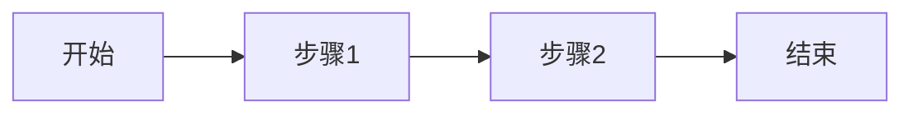

# 基础工作流程示例

这是一个简单的三步骤工作流程示例，展示了最基本的顺序流程模式。

## 流程概述

该示例演示了如何创建一个包含开始节点、两个处理节点和结束节点的简单工作流程。

**流程图可视化：**



## 文件结构

```
basic-workflow/
├── datamodel.cm              # 数据模型定义
└── workflows/
    └── SimpleProcess.workflow.cm  # 工作流程定义
```

## 工作流程详情

### 节点说明

1. **开始节点** (`start_node`)
   - 流程的入口点
   - 接收初始输入数据

2. **步骤1** (`step_1`)
   - 第一个处理步骤
   - 执行初始业务逻辑

3. **步骤2** (`step_2`)
   - 第二个处理步骤
   - 执行后续业务逻辑

4. **结束节点** (`end_node`)
   - 流程的出口点
   - 返回执行结果 "success"

### 连接关系

- `start_node` → `step_1`
- `step_1` → `step_2`
- `step_2` → `end_node`

## 使用方法

1. 在 CrossModel IDE 中打开此项目
2. 查看 `datamodel.cm` 了解数据模型
3. 打开 `workflows/SimpleProcess.workflow.cm` 查看工作流程定义
4. 使用图形编辑器可视化查看流程
5. 运行流程进行测试

## 学习要点

通过这个示例，您可以学习到：

- 如何定义基本的工作流程结构
- 如何使用开始节点和结束节点
- 如何创建处理节点
- 如何连接节点形成流程路径
- 如何设置节点位置信息

## 扩展建议

基于此示例，您可以尝试：

1. 添加更多的处理步骤
2. 为每个节点添加更详细的描述
3. 添加条件分支节点
4. 引入错误处理机制

## 相关文档

- [DSL 语法参考](../../../docs/workflow/DSL-Reference.md)
- [节点类型使用指南](../../../docs/workflow/Node-Types-Guide.md)
- [快速开始指南](../../../docs/workflow/Quick-Start.md)