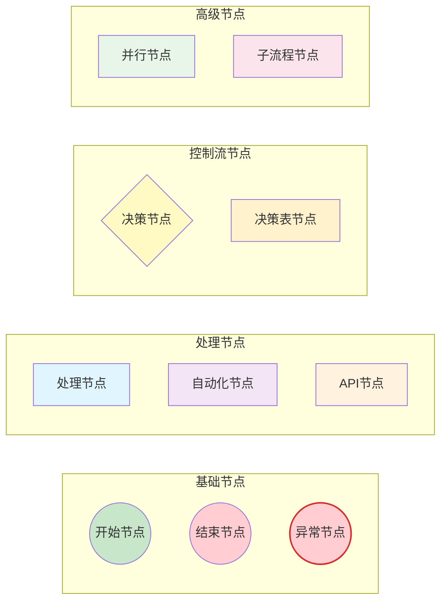
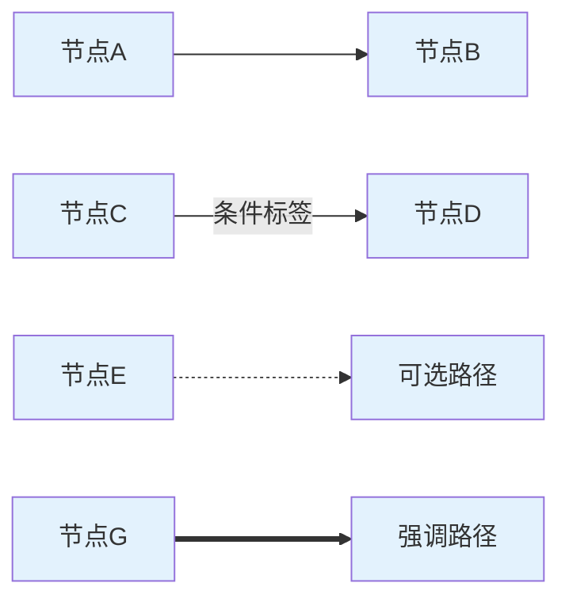
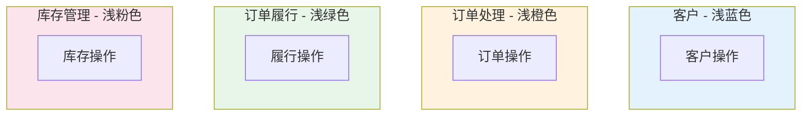
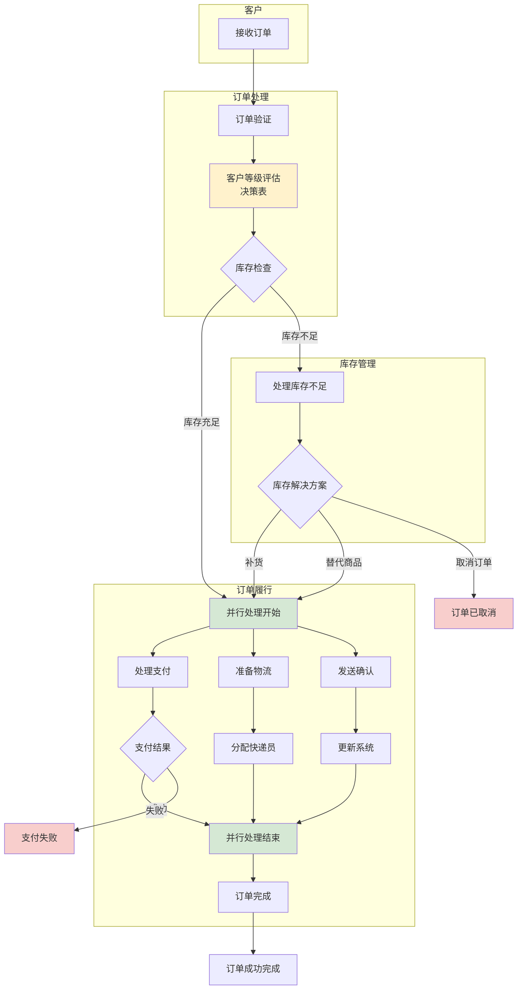
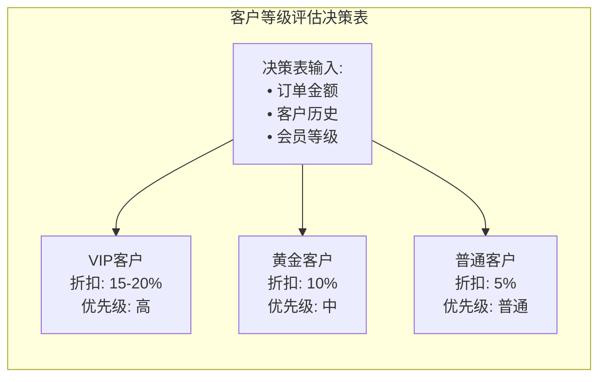
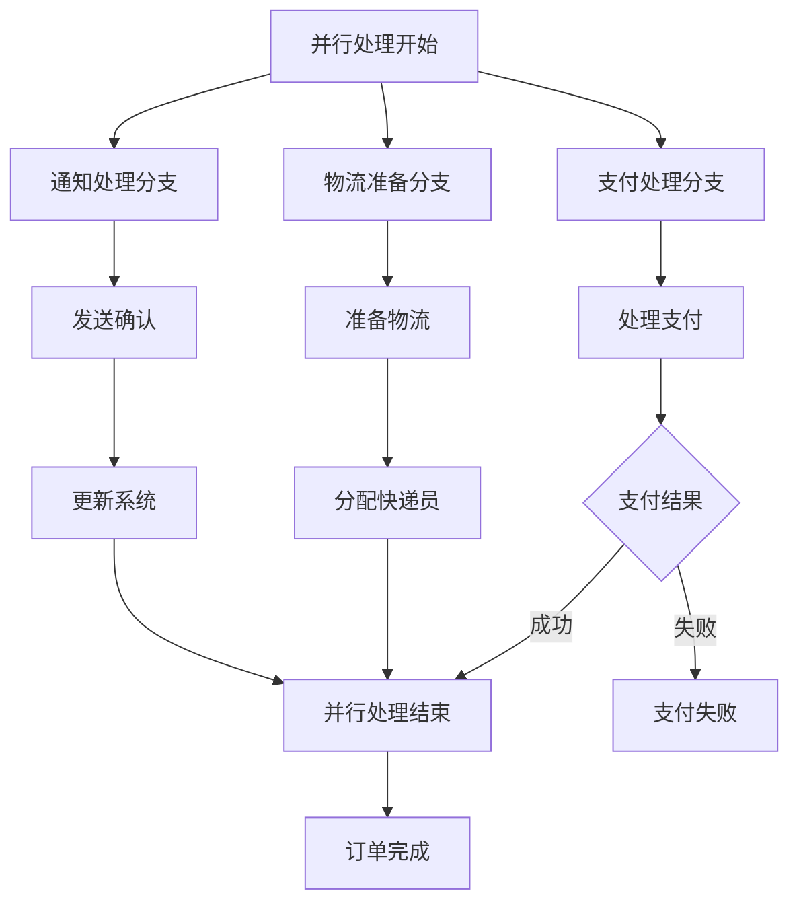

# 电商订单处理流程示例

这是一个完整的电商订单处理工作流程示例，展示了复杂业务流程的建模，包含决策表、并行处理、错误处理和多角色协作等高级功能。

## 流程概述

该示例演示了一个真实的电商平台订单处理流程，从订单接收到最终完成，涵盖了客户等级评估、库存管理、支付处理、物流配送等完整业务环节。

## 图例说明 (Diagram Legend)

### 节点类型图例



### 连接线类型图例



### 泳道颜色图例



**完整流程图可视化：**



**决策表详细视图：**



**并行处理详细视图：**



## 文件结构

```
ecommerce-workflow/
├── datamodel.cm                           # 数据模型定义
└── workflows/
    └── EcommerceOrderProcess.workflow.cm  # 电商订单处理流程定义
```

## 业务流程详情

### 1. 订单接收和验证阶段

**节点说明：**
- **接收订单** (`receive_order`): 客户提交订单，流程开始
- **订单验证** (`validate_order`): 验证订单信息完整性和有效性

### 2. 客户等级评估阶段（决策表）

**决策表配置：**

| 订单金额 | 客户历史 | 会员等级 | 折扣率 | 优先级 | 客户分类 |
|----------|----------|----------|--------|--------|----------|
| ≥2000    | 优秀     | VIP      | 20%    | 高     | VIP客户  |
| <2000    | 优秀     | VIP      | 15%    | 高     | VIP客户  |
| ≥1000    | 良好     | 黄金     | 10%    | 中     | 黄金客户 |
| *        | 普通     | 普通     | 5%     | 普通   | 普通客户 |

**业务规则：**
- VIP客户享受最高折扣和优先处理
- 大额订单自动获得更高折扣
- 客户历史记录影响服务等级

### 3. 库存检查和处理阶段

**库存状态分支：**
- **库存充足** (`in_stock`): 直接进入订单履行
- **库存不足** (`low_stock`): 进入订单履行但标记风险
- **缺货** (`out_of_stock`): 进入库存不足处理流程

**库存不足解决方案：**
- **补货** (`restock`): 联系供应商快速补货
- **替代商品** (`substitute`): 推荐类似商品
- **取消订单** (`cancel`): 取消订单并退款

### 4. 并行订单履行阶段

**三个并行分支：**

#### 支付处理分支
- **处理支付** (`process_payment`): 调用支付网关
- **支付结果** (`payment_result`): 验证支付状态
  - 成功：继续流程
  - 失败：进入异常处理

#### 物流准备分支
- **准备物流** (`prepare_logistics`): 商品包装和准备
- **分配快递员** (`assign_courier`): 根据地址分配配送员

#### 通知处理分支
- **发送确认** (`send_confirmation`): 发送订单确认通知
- **更新系统** (`update_systems`): 同步ERP和CRM系统

### 5. 订单完成阶段

- **订单完成** (`finalize_order`): 最终订单处理
- **订单成功完成** (`order_completed`): 正常结束状态

## 泳道设计

### 角色职责分工

1. **客户泳道**
   - 订单提交
   - 颜色：浅蓝色 (#E3F2FD)

2. **订单处理泳道**
   - 订单验证
   - 客户等级评估
   - 库存检查
   - 颜色：浅橙色 (#FFF3E0)

3. **订单履行泳道**
   - 支付处理
   - 物流准备
   - 系统通知
   - 颜色：浅绿色 (#E8F5E9)

4. **库存管理泳道**
   - 库存不足处理
   - 解决方案制定
   - 颜色：浅粉色 (#FCE4EC)

## 错误处理机制

### 异常节点

1. **支付失败** (`payment_failed_end`)
   - 错误代码：ERR_PAYMENT
   - 触发条件：支付网关返回失败

2. **系统错误** (`system_error`)
   - 错误代码：ERR_SYSTEM
   - 触发条件：系统处理异常

### 补偿机制

- 支付失败时自动释放预留库存
- 系统错误时记录详细日志
- 订单取消时自动退款处理

## 性能优化特性

### 并行处理优势

**传统顺序处理时间：**
- 支付处理：3-5秒
- 物流准备：5-8秒
- 通知发送：2-3秒
- **总计：10-16秒**

**并行处理时间：**
- 最长分支时间：5-8秒
- **总计：5-8秒**
- **性能提升：50-60%**

### 决策表优势

- 业务规则集中管理
- 无需代码修改即可调整规则
- 支持复杂多条件判断
- 便于业务人员维护

## 业务指标

### 关键性能指标 (KPI)

| 指标 | 目标值 | 当前值 |
|------|--------|--------|
| 订单处理时间 | <10秒 | 6-8秒 |
| 支付成功率 | >95% | 97.2% |
| 库存准确率 | >99% | 99.5% |
| 客户满意度 | >4.5/5 | 4.7/5 |

### 流程覆盖率

- 正常订单流程：85%
- 库存不足处理：10%
- 支付失败处理：3%
- 系统异常处理：2%

## 使用方法

1. 在 CrossModel IDE 中打开此项目
2. 查看 `datamodel.cm` 了解数据模型
3. 打开 `workflows/EcommerceOrderProcess.workflow.cm` 查看完整流程
4. 使用图形编辑器查看复杂的节点关系和泳道布局
5. 测试不同的业务场景和异常情况

## 学习要点

通过这个复杂示例，您可以学习到：

- **决策表的高级应用**：多条件业务规则管理
- **并行处理设计**：提高系统性能和用户体验
- **错误处理策略**：完善的异常处理和补偿机制
- **泳道组织**：清晰的角色职责分工
- **复杂流程建模**：真实业务场景的完整建模
- **性能优化**：通过并行处理提升系统效率

## 扩展建议

基于此示例，您可以尝试：

1. **添加更多决策表**
   - 物流方式选择决策表
   - 促销活动决策表
   - 风险评估决策表

2. **增强并行处理**
   - 添加库存预留分支
   - 增加风控检查分支
   - 集成第三方服务分支

3. **完善错误处理**
   - 添加重试机制
   - 实现断路器模式
   - 增加监控告警

4. **业务功能扩展**
   - 订单修改和取消
   - 部分发货处理
   - 售后服务流程

5. **系统集成**
   - ERP系统集成
   - 财务系统对接
   - 数据分析平台

## 相关文档

- [DSL 语法参考](../../../docs/workflow/DSL-Reference.md)
- [节点类型使用指南](../../../docs/workflow/Node-Types-Guide.md)
- [最佳实践和设计模式](../../../docs/workflow/Best-Practices.md)
- [工作流程图例说明](../../../docs/workflow/Diagram-Legend.md)
- [决策表使用指南](../../../docs/workflow/Decision-Table-Guide.md)