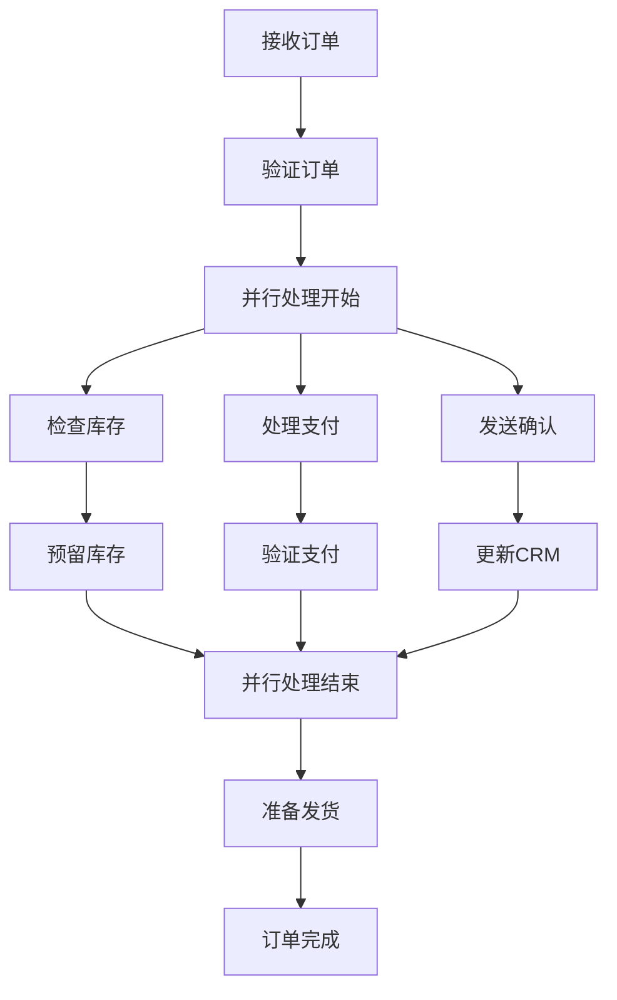

# 并行订单处理流程示例

这是一个展示并行处理能力的订单处理工作流程示例，演示了如何同时执行多个独立的任务以提高处理效率。

## 流程概述

该示例演示了一个电商订单处理流程，其中库存检查、支付处理和通知发送可以并行执行，大大提高了订单处理的效率。

**流程图可视化：**



## 文件结构

```
parallel-workflow/
├── datamodel.cm                      # 数据模型定义
└── workflows/
    └── OrderProcessing.workflow.cm   # 订单处理流程定义
```

## 工作流程详情

### 顺序处理阶段

1. **接收订单** (`receive_order`)
   - 接收客户提交的订单
   - 流程的起始点

2. **验证订单** (`validate_order`)
   - 验证订单信息的完整性和有效性
   - 确保订单数据正确

### 并行处理阶段

并行处理分为三个独立的分支：

#### 库存处理分支
3. **检查库存** (`check_inventory`)
   - 检查商品库存是否充足
   - 验证商品可用性

4. **预留库存** (`reserve_inventory`)
   - 为订单预留商品库存
   - 防止超卖

#### 支付处理分支
5. **处理支付** (`process_payment`)
   - 处理客户支付请求
   - 调用支付网关

6. **验证支付** (`verify_payment`)
   - 验证支付是否成功
   - 确认资金到账

#### 通知处理分支
7. **发送确认** (`send_confirmation`)
   - 发送订单确认邮件给客户
   - 提供订单跟踪信息

8. **更新CRM** (`update_crm`)
   - 更新客户关系管理系统
   - 记录客户购买历史

### 汇聚和完成阶段

9. **并行处理结束** (`parallel_end`)
   - 等待所有并行任务完成
   - 汇聚点，确保所有分支都已完成

10. **准备发货** (`prepare_shipment`)
    - 准备商品发货
    - 生成发货单

11. **订单完成** (`order_complete`)
    - 订单处理完成
    - 流程结束

## 并行处理优势

### 性能提升
- **传统顺序处理**：总时间 = 库存检查时间 + 支付处理时间 + 通知处理时间
- **并行处理**：总时间 = max(库存检查时间, 支付处理时间, 通知处理时间)

### 资源利用
- 充分利用系统资源
- 减少等待时间
- 提高吞吐量

### 用户体验
- 更快的订单确认
- 及时的通知反馈
- 更短的处理周期

## 设计要点

### 并行分支设计原则
1. **独立性**：各分支之间没有数据依赖
2. **原子性**：每个分支内部的操作是原子的
3. **一致性**：所有分支必须成功完成才能继续

### 错误处理考虑
- 任何一个分支失败都会影响整个流程
- 需要设计补偿机制
- 考虑部分成功的情况

## 使用方法

1. 在 CrossModel IDE 中打开此项目
2. 查看 `datamodel.cm` 了解数据模型
3. 打开 `workflows/OrderProcessing.workflow.cm` 查看流程定义
4. 观察并行开始和结束节点的配置
5. 测试并行执行的效果

## 学习要点

通过这个示例，您可以学习到：

- 如何使用并发节点实现并行处理
- 如何设计并行分支的开始和结束
- 如何确保并行分支的独立性
- 如何在并行处理后进行汇聚
- 并行处理的性能优势和设计考虑

## 扩展建议

基于此示例，您可以尝试：

1. 添加错误处理和补偿机制
2. 引入条件并行（根据条件决定是否并行）
3. 添加超时控制机制
4. 实现部分成功的处理逻辑
5. 添加性能监控和统计

## 性能对比

| 处理方式 | 预估时间 | 资源利用率 | 用户体验 |
|----------|----------|------------|----------|
| 顺序处理 | 15-20秒  | 低         | 一般     |
| 并行处理 | 5-8秒    | 高         | 优秀     |

## 相关文档

- [DSL 语法参考](../../../docs/workflow/DSL-Reference.md)
- [节点类型使用指南](../../../docs/workflow/Node-Types-Guide.md)
- [最佳实践和设计模式](../../../docs/workflow/Best-Practices.md)